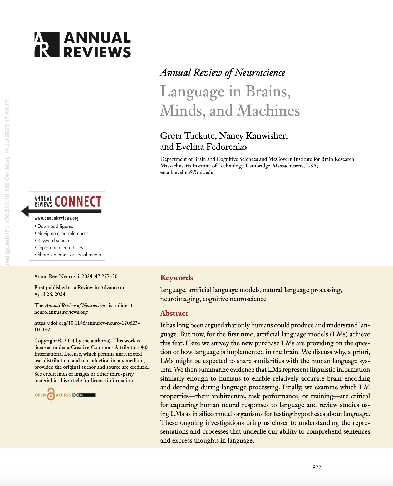

 
    
 
 
    
<h2>This Week's Paper:  Language in Brains, Minds, and Machines</h2>
an overview of how language is processed and understood.

 

[Read the Paper](https://www.annualreviews.org/content/journals/10.1146/annurev-neuro-120623-101142){: .btn }

