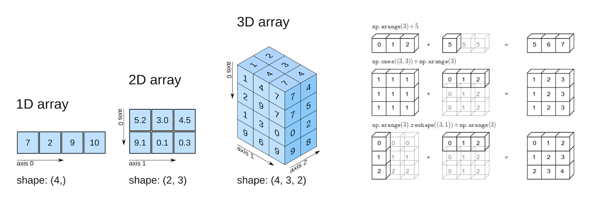
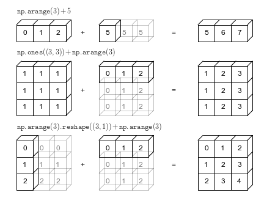

## Intro to Python & Numpy
- **Python** - Popular language commonly used in data science for its extensive libraries and versatility
- **Jupyter Notebook** - Interactive IDE (Integrated Development Environments) commonly used for EDA (exploratory data analysis) and data visualization. [Google Colab](https://colab.research.google.com) is basically the same thing.


***Why Python?***
- **Simplicity** - Python involves very less coding and simple syntax among other languages which can be used for developing AI/ML applications. Due to this feature, the testing can be easier and we can focus more on programming.
- **Libraries** - There are many free, open-source libraries for AI application in Python. (NumPy, Scikit-learn, Keras, TensorFlow, etc.)
- Easy integrations with other languages (C, C++, Java, etc.)

## Numpy
**Arrays** are an essential part in linear algebra and are extremely important when it comes to data science and machine learning. Unfortunately, Python does not have built-in support for arrays, and the memory consumption of built-in data types is not very good.

**NumPy** is a library in Python that supports large, multi-dimensional arrays as well as many mathematical functions to operate on arrays. We will go briefly into the properties of these arrays.
  - A NumPy array is a collection of homogenous data-types that are stored in contiguous memory locations. This allows for array data to be densely packed resulting in less memory consumption in comparison to built-in Python data structures.
  - NumPy is essential to many AI libraries, with many building off of or interfacing directly with NumPy

To create an array, we can do the following:
```python
arr1 = np.array([1,2,3,4,5])
```
----

### Axes, Shape, and Data Type

1. **Axis:**
  - Each dimension is referred to as an "axis."

  - Many NumPy functions allow operations to be performed along a specified axis. Common operations include ```std, mean, var, minimum, maximum,``` etc. The axis parameter in these operations specify the direction along which an operation is applied.

2. **Shape:**
   - The "shape" of an ndarray refers to the size of the array. For example, a 1-dimensional array might have a shape like ```(5,)```, indicating it has 5 elements along a single axis. A 2-dimensional array might have a shape like ```(3, 4)```, indicating it has 3 rows and 4 columns, similar to how it is said in linear algebra.

3. **Data Types:**
   - NumPy provides a set of data types that are more efficient than those built in Python. Many NumPy operations are implemented using C, which is a lower level language in comparison to Python. This allows for operations to be done quicker and more efficiently in NumPy than with the built-in Python data types. This extra speed can make a big difference. Some data types include:
    - int8, int16, int32, int64 (integers with declared bit precision)
    - uint8, uint16, uint32, uint64 (unsigned integers)
    - float16, float32, float64 (floating-point numbers)
    - complex64, complex128 (complex numbers)
    - bool (true or false values)
    - etc.
  - If no data type is specified, one is automatically assigned

```python
# Example: Declare array "arr" to be a 2x5 array of data type int32
arr = np.array([[1,2,3,4,5],
                [6,7,8.0,9,10]],
                dtype='int32')
result = np.sum(arr,axis=1)
result
```

We can also make 3D arrays. Beyond this, multidimensional arrays can really have any number of dimensions; although, we will only directly deal with arrays up to the 3rd dimension.

```python
# Create a 3D NumPy array
arr_3d = np.array([
  [[0, 1, 2], [3, 4, 5], [6, 7, 8]], # Matrix 1
  [[10, 11, 12], [13, 14, 15], [16, 17, 18]], # Matrix 2
  [[20, 21, 22], [23, 24, 25], [26, 27, 28]]  # Matrix 3
  ])
print(arr_3d)
```

----

### Slicing and Indexing
We can access elements in the matrix using **indexing**.
**Slicing** allows the user to access portions of the original array. We will go over common methods for both techniques.

**Integer Indexing**

We can access particular elements in an array using integers, integer arrays, or integer lists.

```python
arr_1D = np.array([5,6,7,8,9])
print(arr_1D[0]) # Indexing starts at 0
```

```python
arr_2d = np.array([[5,6,7],
                   [8,9,0],
                   [3,4,7]])
print(arr_2d[0,:]) # Prints first row
```

```python
# Prints second row
print(arr_2d[1,:])
```

```python
print(arr_2d[:,0])  # Prints first column
```

```python
print(arr_2d[0:2,1:3]) # Print specified array portion
```

**Boolean Indexing**

By using an array of boolean values, we can select certain values in an array. This allows us to use things like masks or filters on the data, which we will be covering more later.

```python
arr_1D = np.array([5,6,7,8,9])
mask = np.array([False, True, False, True, False])
arr_1D[mask]
```

----

### Useful Array Functions
***ndim*** - check the number of dimensions in an array
```python
arr_3d.ndim
```
 
***shape*** - check the shape of the matrix 
```python
arr_3d.shape
```
 
***dtype*** - checks the data type of an array
```python
arr_3d.dtype
```
 
***size*** - returns the number of elements in an array
```python
arr_3d.size
```
 
***np.sort()*** - returns a sorted copy of an array along a specified axis
```python
arr = np.array([4,6,8,0,7,1,13,93])
sorted_arr = np.sort(arr, axis=0)
print(sorted_arr)
```
 
***np.zeros() and np.ones()*** - Create arrays with only zeros or ones of specified size
```python
zero_arr = np.zeros((6,3))
print(zero_arr)
```
 
***np.linspace()*** - Create an array with a specified number of evenly spaced values.
```python
linspace_arr = np.linspace(0, 1, 5)
print(linspace_arr)
```

***np.reshape()*** - reshapes a given array (make sure that the reshape is valid)
```python
arr_2d = np.array([[1,2,3],
                   [4,5,6]])
reshaped_arr_2d = arr_2d.reshape(3,2)
print(reshaped_arr_2d)
```

***np.min(), np.max(), np.mean(), np.sum()*** - gives the min, max, mean, and sum along a particular axis
```python
arr = np.array([[1,2,3],
                [4,5,6],
                [7,8,9]])
arr_mean_columns = np.mean(arr, axis=0)
print(arr_mean_columns)
```

***np.argmax() and np.argmin()*** - Find the indices of the maximum and minimum values in an array.
```python
arr_2d = np.array([[1,2,3],
                   [4,5,6]])
min_arg = np.argmin(arr_2d)
print(min_arg)
```

***np.random.rand() and np.random.randn()*** - Returns an array of random numbers or normally distribusted random numbers, respectively, of a specified size
```python
arr = np.random.rand(3,4)
```
 
***np.random.randint()*** - Returns an array of random integers of specified range and size
```python
arr = np.random.randint(low=1, high=8, size=(2,4)) # Range: lower=1(inclusive), upper=8(exclusive)
```

***np.linalg.inv()*** - Compute the inverse of a matrix.

***np.linalg.det()*** - Compute the determinant of a matrix.

----

### Arithmetic Operations
NumPy is capable of performing numerous arithmetic operations on matrices ```+,-,*,/```. These arithmetic operators are done by element, referred to as element-wise operations.

**Element-wise Operations** - (vectorized operations) operations that are performed individually on each element of an array. The operation is applied to each element of the array independently, resulting in a new array with the same shape and size as the original.

```python
arr1 = np.array([[1,2],
                 [3,4]])
arr2 = np.array([[5,6],
                 [7,8]])

#elementwise: 
arr1 + arr2 #addition
arr1 - arr2 #subtraction
arr1 * arr2 #multiplication
arr1 / arr2 #division
```

----

### Broadcasting
What if you want to use operations on mismatched arrays? In some cases, NumPy will **"broadcast"** an array to perform these operations. An array can be stretched in order to make it compatible for element-wise operations



----

### Masks
Masks and filters allow us to make conditions for selecting values from a matrix using boolean indexing. Here are some examples.

```python
# Print numbers in a matrix greater than 5
arr = np.array([1,2,3,4,5,6,7,8])
mask = arr > 5
print(arr[mask])
```

```python
# Print all even numbers in the array
arr = np.array([[1,2,3,4],
                [5,6,7,8],
                [9,10,11,12]])

mask = (arr % 2) == 0
arr[mask]
```