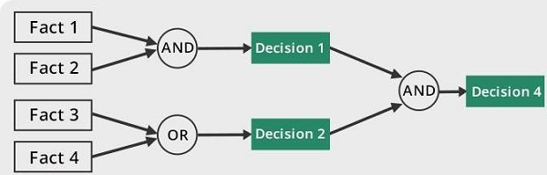

## What is AI/ML?
Before diving into code, it is important to separate the broad field from the method we will mostly use.

- **Artificial Intelligence (AI):** building systems that perform tasks associated with intelligent behavior.
- **Machine Learning (ML):** a subset of AI where systems learn patterns from data instead of relying only on hand-written rules.

In this course, we focus mostly on machine learning.

----

## Learning Objectives
By the end of this lesson, you should be able to:
1. Define AI and ML in plain language.
2. Compare symbolic and connectionist approaches.
3. Explain why data quality strongly affects model outcomes.

----

## Types of AI Approaches
### Symbolic AI (Rule-based)
- Explicit rules and logic (if-then reasoning)
- Useful when rules are clear and stable

### Connectionist AI (Data-driven)
- Learns patterns from examples
- Uses statistical learning and optimization
- Usually needs enough representative data

----

## Why Data Matters
Model behavior depends on training data quality.
- Biased or incomplete data can create unreliable results.
- Clean, representative data improves generalization.
- Evaluation only makes sense when data handling is sound.

----

## Expected Outcomes
After this page, you should be ready to:
- Move into Python/NumPy data workflows.
- Understand why evaluation and feature engineering are core ML skills, not optional extras.

----

## Self-Check
1. In one sentence each, define AI and ML.
2. Give one symbolic system example and one ML system example.
3. Why can two models with identical code perform very differently?

For answer guidance, see [Checkpoints](../assessments/checkpoints.html).
