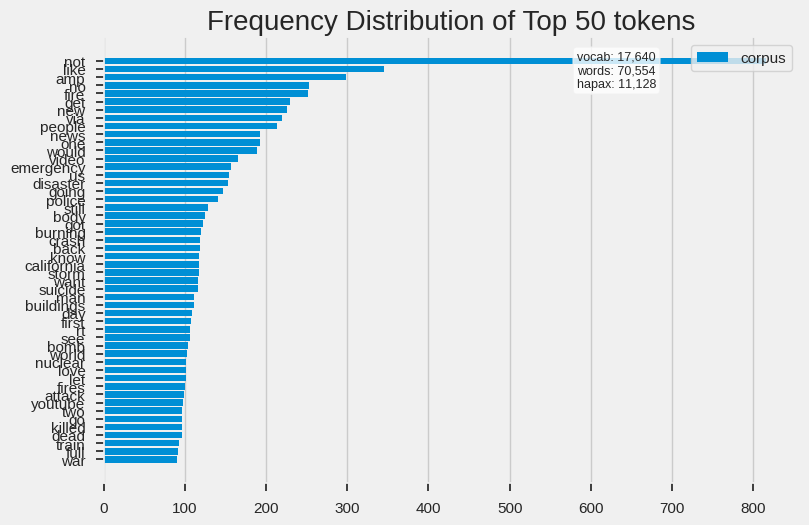
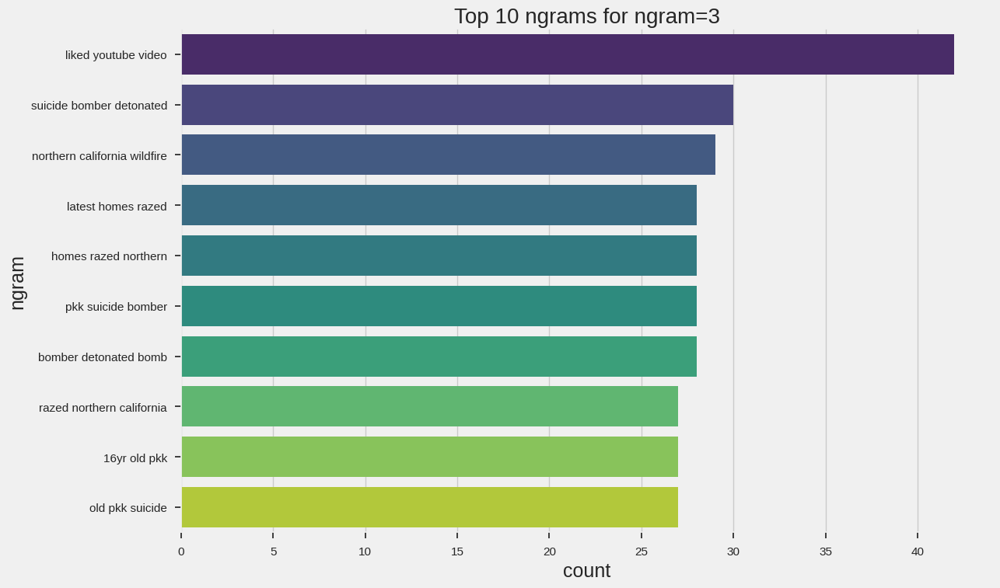

## Natural Language Processing with Disaster Tweets
(based on [this project](https://medium.com/bitgrit-data-science-publication/nlp-snippets-in-python-90ac29ffaea0))

### Objective
Predict which tweets are about real disasters and which are not.

### Prerequisites
- Basic Python functions and loops
- Familiarity with dataframes and string operations

### Setup
- Run in Google Colab.
- Install required NLP dependencies from the setup section below.

### Tasks
- Implement the text-cleaning utility functions.
- Build cleaned text features and inspect distributions.
- Prepare outputs suitable for a downstream classifier.

----

### Environment Setup

Install necessary data/libraries

```bash
!pip install pyspellchecker &> /dev/null
!pip install contractions &> /dev/null
!pip install num2words &> /dev/null
!pip install emoji &> /dev/null
!pip install textacy &> /dev/null
!pip install nltk &> /dev/null
```

Setup

```python
# data science
import pandas as pd
import numpy as np

# plotting
import matplotlib.pyplot as plt
import seaborn as sns
from wordcloud import WordCloud
from yellowbrick.text import TSNEVisualizer

plt.style.use('fivethirtyeight')
sns.set_context("notebook", rc={"font.size":16,
                                "axes.titlesize":20,
                                "axes.labelsize":18})

# nlp
import re
import string

from collections import Counter
from spellchecker import SpellChecker
import contractions
from num2words import num2words
import emoji
import random
from textacy import extract

# nltk
import nltk
from nltk.corpus import stopwords
from nltk.stem import WordNetLemmatizer, PorterStemmer
from nltk.tokenize import word_tokenize
from nltk.corpus import wordnet

nltk.download('stopwords')
nltk.download('wordnet')
nltk.download('punkt')
nltk.download('wordnet')
nltk.download('averaged_perceptron_tagger')
nltk.download('punkt')

from sklearn.feature_extraction.text import CountVectorizer, TfidfVectorizer
from yellowbrick.text.freqdist import FreqDistVisualizer

from gensim.models import Word2Vec

# misc
# progress bar
from tqdm import tqdm
tqdm.pandas()

# color outputs
from termcolor import colored

# warnings
import warnings
warnings.filterwarnings("ignore")

# Typing
from typing import List, Tuple

# !python -m spacy download en_core_web_sm
```

A note on the libraries being used:

**For the actual program:**
*   spellchecker: pure python spell checking using the levenshtein
*   contractions: fixes contractions such as "you're"  to "you are"
*   num2words: convert numbers to words. 42 --> forty-two
*   emoji: python emojis
*   textacy: python library for NLP tasks built on spaCy
*   nltk: leading platform for building python programs to work with human language data

**For visualization:**
*   yellowbrick: machine learning visualization
*   gensim: topic modelling for Humans, vector embedding
*   tqdm: fast, extendible progress bar
*   termcolor: color formatting for output

### Text Cleanup and Preprocessing
**Convert to lowercase**

Creating function to convert text to lowercase

```python
def lower_case(text: str) -> str:
    return text.lower()
```

**Remove whitespace, linebreaks, and tabs**

```python
def remove_spaces_tabs(text: str) -> str:
    return " ".join(text.split())
```

**Get rid of punctuation**

```python
def remove_punct(text: str) -> str:
    translator = str.maketrans("", "", string.punctuation)
    return text.translate(translator)
```

**Remove single characters**

```python
def remove_single_char(text: str) -> str:
    return re.sub(r"\b[a-zA-Z]\b", "", text)
```

**Remove html formatting**

```python
def remove_html(text: str) -> str:
    html = re.compile(r"<.*?>")
    return html.sub(r"", text)
```

**Remove URL**

```python
def remove_url(text: str) -> str:
    url = re.compile(r"https?://\S+|www\.\S+")
    return url.sub(r"", text)
```

**Removing Emojis**
```python
def remove_emoji(text: str) -> str:
    # Reference : https://gist.github.com/slowkow/7a7f61f495e3dbb7e3d767f97bd7304b
    emoji_pattern = re.compile(
        "["
        "\U0001F600-\U0001F64F"  # emoticons
        "\U0001F300-\U0001F5FF"  # symbols & pictographs
        "\U0001F680-\U0001F6FF"  # transport & map symbols
        "\U0001F1E0-\U0001F1FF"  # flags (iOS)
        "]+",
        flags=re.UNICODE,
    )
    return emoji_pattern.sub(r"", text)
```

**Remove Stopwords**

Stopwords are common words in text that are not significant.

```python
def remove_stopwords(text: str) -> str:
    stop_words = set(stopwords.words("english"))
    stop_words.update(["time"]) # add custom stopwords
    stop_words -= {"no", "not"} # remove custom stopwords
    word_tokens = word_tokenize(text)
    filtered_sentence = [w for w in word_tokens if not w in stop_words]
    return " ".join(filtered_sentence)
```

**Convert emojis to text**
```python
def emoji2word(text: str) -> str:
    return " ".join([emoji.demojize(w) if w in emoji.EMOJI_DATA else w for w in text.split()])
```

**Convert digits to words**
```python
def convert_digits_to_words(text: str) -> str:
    return " ".join([num2words(w) if w.isdigit() else w for w in text.split()])
```

**Update and expand contractions**
```python
def expand_contractions(text: str) -> str:
    return contractions.fix(text)
```

**Lemmatization**
```python
from nltk.stem import WordNetLemmatizer
from nltk.corpus import wordnet
def lemmatize_text_custom(text: str, lemmatizer) -> str:
    wordnet_map = {
        "J": wordnet.ADJ,
        "N": wordnet.NOUN,
        "V": wordnet.VERB,
        "R": wordnet.ADV,
    }

    w_pos_tags = nltk.pos_tag(text.split())
    lemmatized_output = " ".join([lemmatizer.lemmatize(w, wordnet_map.get(pos[0], wordnet.NOUN)) for w, pos in w_pos_tags])
    return lemmatized_output
```

**Stemming**

Reducing the words to only the word stems.

```python
def stem_text_custom(text: str, stemmer) -> str:
    word_tokens = word_tokenize(text)
    stemmed_output = " ".join([stemmer.stem(w) for w in word_tokens])
    return stemmed_output
```

**Spell Check**

Finally, we spell check the test for better data.

```python
def correct_spelling(text: str) -> str:
    spell = SpellChecker()
    corrected_text = []
    misspelled_words = spell.unknown(text.split())
    for word in text.split():
        if word in misspelled_words:
            # if correction is none return the original word
            if spell.correction(word) is not None:
                corrected_text.append(spell.correction(word))
            else:
                corrected_text.append(word)
        else:
            corrected_text.append(word)
    return " ".join(corrected_text)
```

----

### Reading the Data

```python
url_train = 'https://drive.google.com/file/d/16r3kpP6Z6Jpeb6TLXYAS_asj6YUyh575/view?usp=sharing'
url_test = 'https://drive.google.com/file/d/1TkOWOFK-XiIHBytAlkbFKQoh_Yb9tVFj/view?usp=sharing'

path = 'https://drive.google.com/uc?export=download&id='+url_train.split('/')[-2]

df_train = pd.read_csv(path)

path = 'https://drive.google.com/uc?export=download&id='+url_test.split('/')[-2]

df_test = pd.read_csv(path)

print('train shape = {}'.format(df_train.shape))
print('train memory = {:.3f} MB'.format(df_train.memory_usage().sum() / 1024**2))
print('Test shape = {}'.format(df_test.shape))
print('Test memory = {:.3f} MB'.format(df_test.memory_usage().sum() / 1024**2))
```

```markdown
train shape = (7613, 5)
train memory = 0.291 MB
Test shape = (3263, 4)
Test memory = 0.100 MB
```

```python
df_train.head()
```

|id | keyword  | location | text                                          | target  |
| - | --- | ------- | ------------------------------------------------- | --------- | 
| 1 | NaN | NaN     | Our Deeds are the Reason of this #earthquake M... | 1         |
| 4 | NaN | NaN     | Forest fire near La Ronge Sask. Canada            | 1         |
| 5 | NaN | NaN     | All residents asked to 'shelter in place' are ... | 1         |
| 6 | NaN | NaN     | 13,000 people receive #wildfires evacuation or... | 1         |
| 7 | NaN | NaN     | Just got sent this photo from Ruby #Alaska as ... | 1<br><br> |

**target**:'1' indicates a real disaster and '0' indicates a not real disaster

**text**: the text of the tweet

**location**: where the tweet orginated

**keyword**: a particular keyword from the tweet (may be blank)

**id**: unique id given to each tweet

----

### Text Preprocessing

Creating a text cleaning pipeline using the functions we just made.

```python
pipeline = [
    lower_case,
    expand_contractions,
    remove_spaces_tabs,
    remove_url,
    remove_punct,
    remove_single_char,
    remove_html,
    remove_stopwords,
    # other functions...
]

def prepare(text, pipeline, lemmatizer=None, stemmer=None):
    tokens = text
    for transform in pipeline:
        # if lemmatize or stem function pass in, perform transformation
        if transform.__name__ == "lemmatize_text_custom":
            tokens = transform(tokens, lemmatizer)
        elif transform.__name__ == "stem_text_custom":
            tokens = transform(tokens, stemmer)
        else:
            tokens = transform(tokens)

    return tokens


df_train["clean_text"] = df_train["text"].progress_apply(prepare, pipeline=pipeline)
```

```python
df_test["clean_text"] = df_test["text"].progress_apply(prepare, pipeline=pipeline)
```

---- 

### Data Visualizations


**n-grams**
```python
def get_top_ngrams(text: pd.Series, ngram: int =1, top_n: int =10) -> List[Tuple[str, int]]:
    vec = CountVectorizer(ngram_range=(ngram, ngram), stop_words="english").fit(text)
    bag_of_words = vec.transform(text)
    sum_words = bag_of_words.sum(axis=0)
    words_freq = [(word, sum_words[0, idx]) for word, idx in vec.vocabulary_.items()]
    words_freq = sorted(words_freq, key=lambda x: x[1], reverse=True)
    return words_freq[:top_n]
```

**unigrams**
```python
get_top_ngrams(df_train["clean_text"])
```

```markdown
[('like', 345),
 ('amp', 298),
 ('new', 226),
 ('people', 213),
 ('news', 193),
 ('video', 165),
 ('emergency', 157),
 ('disaster', 153),
 ('going', 147),
 ('police', 141)]
```

```python
def plot_freq_dist(text: pd.Series) -> None:
    vectorizer = CountVectorizer()
    docs = vectorizer.fit_transform(text)
    features = vectorizer.get_feature_names_out()

    visualizer = FreqDistVisualizer(features=features)
    visualizer.fit(docs)
    visualizer.poof();

plot_freq_dist(df_train["clean_text"])
```



**Trigram**
```python
get_top_ngrams(df_train["clean_text"],3)
```

```markdown
[('liked youtube video', 42),
 ('suicide bomber detonated', 30),
 ('northern california wildfire', 29),
 ('latest homes razed', 28),
 ('homes razed northern', 28),
 ('pkk suicide bomber', 28),
 ('bomber detonated bomb', 28),
 ('razed northern california', 27),
 ('16yr old pkk', 27),
 ('old pkk suicide', 27)]
```

```python
def plot_ngrams_bar(text: pd.Series, ngram: int =1, top_n: int =10) -> None:
    ngrams = get_top_ngrams(text, ngram, top_n)
    df_ngrams = pd.DataFrame(ngrams, columns=["ngram", "count"])
    plt.figure(figsize=(12, 8))
    sns.barplot(x="count", y="ngram", data=df_ngrams, palette="viridis")
    plt.title(f"Top {top_n} ngrams for ngram={ngram}")
    plt.show()


plot_ngrams_bar(df_train["clean_text"], ngram=3)
```



From here, we can use **deep learning** models to predict for the target. For that look [here](https://www.kaggle.com/code/alexia/kerasnlp-starter-notebook-disaster-tweets).

----

### Validation
- Cleaning pipeline runs on sample text and full dataset columns.
- Frequency and n-gram visualizations are generated successfully.
- Final cleaned text column is ready for model input.

### Extensions
- Compare lemmatization vs stemming impact on vocabulary size.
- Add TF-IDF baseline model and report classification metrics.
- Error-analyze misclassified tweets after a baseline classifier.

### Deliverable
- Notebook with preprocessing + EDA figures.
- Final cleaned dataset preview and feature extraction cell.
- Short markdown summary of key language patterns discovered.
