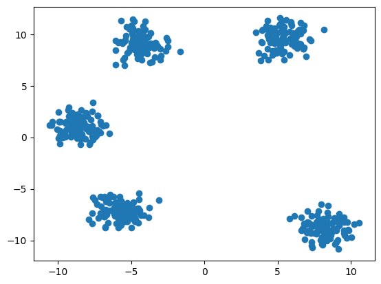
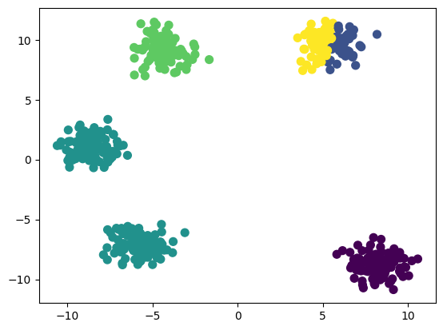

## Spotify Intelligent Music Recommendation
Now that you have some experience with machine learning models, let's put them to use! For this mini, we will be using a dataset of nearly 1000 of Spotify's most streamed songs to create a music recommendation system.

There are many ways to go about this, but we'll focus on an unsupervised model (more specifically, clustering) to make recommendations.

----

### Loading the Data
Download the dataset from [here](../datasets/spotify-2023.csv)
```python
import pandas as pd
import numpy as np
path = '../datasets/spotify-2023.csv' #replace this with your path/to/dataset
df = pd.read_csv(path, encoding='latin-1')
```

```python
df.head()
```

|track_name|	artist(s)_name	|artist_count	|released_year|	released_month	|released_day	|in_spotify_playlists|	in_spotify_charts	|streams	|in_apple_playlists	|...	|bpm|	key|	mode|	danceability_%	|valence_%	|energy_%	|acousticness_%	|instrumentalness_%	|liveness_%|	speechiness_%|
|:---|:---|:---|:---|:---|:---|:---|:---|:---|:---|:---|:---|:---|:---|:---|:---|:---|:---|:---|:---|:---|
|Seven (feat. Latto) (Explicit Ver.)|	Latto, Jung Kook|	2|	2023|	7|	14|	553|	147|	141381703|	43|	...|	125|	B|	Major|	80|	89|	83|	31|	0|	8|	4|
|LALA|	Myke Towers|	1|	2023|	3|	23|	1474|	48|	133716286|	48|	...|	92|	C#|	Major|	71|	61|	74|	7|	0|	10|	4|
|vampire|	Olivia Rodrigo|	1|	2023|	6|	30|	1397|	113|	140003974|	94|	...|	138|	F|	Major|	51|	32|	53|	17|	0|	31|	6|
|Cruel Summer|	Taylor Swift|	1|	2019|	8|	23|	7858|	100|	800840817|	116|	...|	170|	A|	Major|	55|	58|	72|	11|	0|	11|	15|
|WHERE SHE GOES	|Bad Bunny|	1|	2023|	5|	18|	3133|	50|	303236322|	84|	...|	144|	A|	Minor|	65|	23|	80|	14|	63|	11|	6|

----

### Data Cleaning and Preprocessing
```python
df.info()
```

```markdown
RangeIndex: 953 entries, 0 to 952
Data columns (total 24 columns):
 \#   Column                Non-Null Count  Dtype 
---  ------                --------------  ----- 
 0   track_name            953 non-null    object
 1   artist(s)_name        953 non-null    object
 2   artist_count          953 non-null    int64 
 3   released_year         953 non-null    int64 
 4   released_month        953 non-null    int64 
 5   released_day          953 non-null    int64 
 6   in_spotify_playlists  953 non-null    int64 
 7   in_spotify_charts     953 non-null    int64 
 8   streams               953 non-null    object
 9   in_apple_playlists    953 non-null    int64 
 10  in_apple_charts       953 non-null    int64 
 11  in_deezer_playlists   953 non-null    object
 12  in_deezer_charts      953 non-null    int64 
 13  in_shazam_charts      903 non-null    object
 14  bpm                   953 non-null    int64 
 15  key                   858 non-null    object
 16  mode                  953 non-null    object
 17  danceability_%        953 non-null    int64 
 18  valence_%             953 non-null    int64 
 19  energy_%              953 non-null    int64 
 20  acousticness_%        953 non-null    int64 
 21  instrumentalness_%    953 non-null    int64 
 22  liveness_%            953 non-null    int64 
 23  speechiness_%         953 non-null    int64 
dtypes: int64(17), object(7)
memory usage: 178.8+ KB
```
----
**Dealing with ```null``` Values**
```python
df.isnull().sum()
```
```markdown
track_name               0
artist(s)_name           0
artist_count             0
released_year            0
released_month           0
released_day             0
in_spotify_playlists     0
in_spotify_charts        0
streams                  0
in_apple_playlists       0
in_apple_charts          0
in_deezer_playlists      0
in_deezer_charts         0
in_shazam_charts        50
bpm                      0
key                     95
mode                     0
danceability_%           0
valence_%                0
energy_%                 0
acousticness_%           0
instrumentalness_%       0
liveness_%               0
speechiness_%            0
dtype: int64
```

Null keys account for 10% of all the rows meaning that this column is likely unreliable. We can either remove about 10% of our rows or remove a column. For the sake of keeping variety in our data points, we will drop the key column for traing the model.

```python
df.drop(columns=['key'], inplace=True)
```

We notice that shazam charts also has null values. Since there are less rows with null values in this column, we can likely fill the null values with the median. We want to use the median rather than mean because data like this tends to be skewed in one direction, biasing the mean.

```python
df['in_shazam_charts'] = df['in_shazam_charts'].replace(',','', regex=True)
```

```python
df['in_shazam_charts'] = df['in_shazam_charts'].fillna(df['in_shazam_charts'].notnull().median()).astype(np.int64)
```

```python
df.isnull().sum()
```

```markdown
track_name              0
artist(s)_name          0
artist_count            0
released_year           0
released_month          0
released_day            0
in_spotify_playlists    0
in_spotify_charts       0
streams                 0
in_apple_playlists      0
in_apple_charts         0
in_deezer_playlists     0
in_deezer_charts        0
in_shazam_charts        0
bpm                     0
mode                    0
danceability_%          0
valence_%               0
energy_%                0
acousticness_%          0
instrumentalness_%      0
liveness_%              0
speechiness_%           0
dtype: int64
```

----
**Dealing with Incorrect Values**
We observe that "streams" is an object datatype column. To us, this does not make any sense. Upon further investigation, there seems to be a some rows with strings as their "streams" value. Let's get rid of them.

```python
df = df[df["streams"].str.contains("[a-zA-Z]") == False]
```

```python
df['streams'] = df['streams'].replace(',','', regex=True).astype(np.int64)
```

The same issue is present in "in_deezer_playlists". Let's do the same.

```python
df = df[df["in_deezer_playlists"].str.contains("[a-zA-Z]") == False]
df['in_deezer_playlists'] = df['in_deezer_playlists'].replace(',','', regex=True).astype(np.int64)
```

Next, we want to remove duplicate tracks. We will treat 'track_name' and 'artist(s)_name' as a **composite primary key**. This means that each song is uniquely identified by its name and artist and should not appear twice.

```python
df = df.drop_duplicates(['track_name', 'artist(s)_name'])
```

Finally, let's make sure our data looks good.

```python
df.info()
```

```markdown
Int64Index: 948 entries, 0 to 952
Data columns (total 23 columns):
 #   Column                Non-Null Count  Dtype 
---  ------                --------------  ----- 
 0   track_name            948 non-null    object
 1   artist(s)_name        948 non-null    object
 2   artist_count          948 non-null    int64 
 3   released_year         948 non-null    int64 
 4   released_month        948 non-null    int64 
 5   released_day          948 non-null    int64 
 6   in_spotify_playlists  948 non-null    int64 
 7   in_spotify_charts     948 non-null    int64 
 8   streams               948 non-null    int64 
 9   in_apple_playlists    948 non-null    int64 
 10  in_apple_charts       948 non-null    int64 
 11  in_deezer_playlists   948 non-null    int64 
 12  in_deezer_charts      948 non-null    int64 
 13  in_shazam_charts      948 non-null    int64 
 14  bpm                   948 non-null    int64 
 15  mode                  948 non-null    object
 16  danceability_%        948 non-null    int64 
 17  valence_%             948 non-null    int64 
 18  energy_%              948 non-null    int64 
 19  acousticness_%        948 non-null    int64 
 20  instrumentalness_%    948 non-null    int64 
 21  liveness_%            948 non-null    int64 
 22  speechiness_%         948 non-null    int64 
dtypes: int64(20), object(3)
memory usage: 177.8+ KB
```

----

**Basic Data Descriptions**
```python
df.describe()
```

|stat|artist_count|released_year|released_month|released_day|in_spotify_playlists|in_spotify_charts|streams     |in_apple_playlists|in_apple_charts|in_deezer_playlists|in_deezer_charts|in_shazam_charts|bpm       |danceability_%|valence_% |energy_%  |acousticness_%|instrumentalness_%|liveness_%|speechiness_% 
------------|-------------|--------------|------------|--------------------|-----------------|------------|------------------|---------------|-------------------|----------------|----------------|----------|--------------|----------|----------|--------------|------------------|----------|-----------------|-----|----|---|---|---|---|---|---
count| 948.000000  |948.000000   |948.000000    |948.000000  |948.000000          |948.000000       |9.480000e+02|948.000000        |948.000000     |948.000000         |948.000000      |948.000000      |948.000000|948.000000    |948.000000|948.000000|948.000000    |948.000000        |948.000000|948.000000       
mean| 1.559072    |2018.274262  |6.037975      |13.929325   |5205.736287         |12.072785        |5.140179e+08|67.709916         |52.053797      |386.427215         |2.658228        |56.830169       |122.473629|66.966245     |51.376582 |64.261603 |27.159283     |1.568565          |18.184599 |10.154008        
std| 0.894481    |11.032289    |3.567220      |9.194844    |7914.809436         |19.608092        |5.679277e+08|86.346061         |50.674649      |1133.346458        |6.019615        |157.496879      |28.047409 |14.644716     |23.519759 |16.585738 |26.025796     |8.410065          |13.706098 |9.933332         
min| 1.000000    |1930.000000  |1.000000      |1.000000    |31.000000           |0.000000         |2.762000e+03|0.000000          |0.000000       |0.000000           |0.000000        |0.000000        |65.000000 |23.000000     |4.000000  |9.000000  |0.000000      |0.000000          |3.000000  |2.000000         
25%| 1.000000    |2020.000000  |3.000000      |6.000000    |874.500000          |0.000000         |1.411439e+08|13.000000         |7.000000       |13.000000          |0.000000        |0.000000        |99.000000 |57.000000     |32.000000 |53.000000 |6.000000      |0.000000          |10.000000 |4.000000         
50%| 1.000000    |2022.000000  |6.000000      |13.000000   |2216.500000         |3.000000         |2.876903e+08|34.000000         |38.500000      |44.000000          |0.000000        |2.000000        |120.500000|69.000000     |51.000000 |66.000000 |18.000000     |0.000000          |12.000000 |6.000000         
75%| 2.000000    |2022.000000  |9.000000      |22.000000   |5503.750000         |16.000000        |6.729425e+08|87.250000         |87.000000      |164.000000         |2.000000        |33.250000       |140.000000|78.000000     |70.000000 |77.000000 |43.000000     |0.000000          |23.250000 |11.000000        
max| 8.000000    |2023.000000  |12.000000     |31.000000   |52898.000000        |147.000000       |3.703895e+09|672.000000        |275.000000     |12367.000000       |58.000000       |1451.000000     |206.000000|96.000000     |97.000000 |97.000000 |97.000000     |91.000000         |97.000000 |64.000000<br><br>

```python
df.describe(include='object')
```

|stat       |track_name  |artist(s)_name|mode|
|-----------|------------|--------------|----|-----|------|---|----|
|count|948        |948         |948           |
|unique|942        |644         |2             |
|top| Die For You|Taylor Swift|Major         |
|freq| 2          |34          |546           |

Unsurprisingly, Taylor Swift has 34 appearances on the top charts.
The data looks pretty good so far, so let's move on to some basic visualizations.

----
### Basic Visualizations
```python
import seaborn as sns
```

**Artists and Frequency**

```python
artist_counts = df['artist(s)_name'].value_counts().sort_values(ascending=False)

plt.figure(figsize=(10,6))
plt.style.use(['ggplot'])
c = sns.color_palette("pastel")
artist_counts.head(10).plot.bar(color=c)
plt.xlabel("Artist")
plt.ylabel("Frequency")
plt.title('Artist Occurance in top 1000 Songs of 2023')
```


**Release Year**
```python
songs_by_year = df['released_year'].value_counts().reset_index()
songs_by_year.columns = ['released_year', 'count']

plt.figure(figsize=(10, 6))
sns.barplot(x='released_year', y='count', data=songs_by_year.head(15), palette='PuRd',hue='released_year', legend=False)
plt.title('Number of Songs by Release Year')
plt.xlabel('Release Year')
plt.ylabel('Number of Songs')
plt.show()
```


**BPM Distribution**
```python
plt.figure(figsize=(10, 6))
df['bpm'].hist(color='gray',bins=12)
plt.xlabel("BPM")
plt.ylabel("Frequency")
plt.title('Song BPM Distribution')
```


**Pair Plot of Attributes**
```python
df_attribute = df[['danceability_%','valence_%','energy_%','acousticness_%','instrumentalness_%','liveness_%','speechiness_%']]

plt.figure(figsize=(9, 9))
sns.set_style("white")
plt.style.use(['ggplot'])
sns.pairplot(df_attribute, height=1.5)
```


We can see that there really isn't much of a linear correlation between these variables. In fact, many don't show any correlation. Let's look at a heat map to better visualize this.

**Correlation Heatmap**
```python
numeric_df = df.select_dtypes(include=['float64', 'int64'])

# Calculate the correlation matrix
correlation_matrix = numeric_df.corr()

# Plot the correlation matrix using Seaborn
plt.figure(figsize=(10, 10))
sns.heatmap(correlation_matrix, annot=True, cmap='coolwarm', fmt=".2f")
plt.title('Correlation Matrix')
plt.show()
```


As expected. The attributes we looked at in the pair pot don't have much of a correlation, except for the decent negative correlation in energy and acousticness, which we expected to see.

Now we have a good idea of what our data is like. We can now move on to machine learning.

----

## Preparing for Machine Learning
Before we move on to machine learning, we have to look deeper into the variable we will be using. We will be using a clustering algorithm, meaning that there are no labels to worry about. With that being said, there is still an issue with categorical and numeric data. We observe that month is denoted with a numeric value. This does not really make any sense as a numeric value, and works better as a categorical variable. Let's make this change.

```python
def month_number_to_name(month_number):
    months = [
        None,
        "January", "February", "March", "April",
        "May", "June", "July", "August",
        "September", "October", "November", "December"
    ]
    if month_number < 1 or month_number > 12:
        return "Invalid month number"

    return months[month_number]

df['released_month'] = df['released_month'].astype(object)
df.released_month = df.released_month.apply(lambda x: month_number_to_name(x))
```

Before we run this on the machine learning model, we will have to encode catagorical variables.

```python
dummies = pd.get_dummies(df['mode'],prefix="mode")

df_encode = pd.concat([df, dummies], axis=1)

#dummies = pd.get_dummies(df['released_month'],prefix="released_month")

#df_encode = pd.concat([df_encode, dummies], axis=1)

df_encode.drop(columns=["released_month","mode","artist(s)_name","track_name","release_day"], inplace=True)
```

Note: we processed the months as columns, but we drop them for our model since the month of release has little to do with the kind of song we recommend. The same is done for release day, track name, mode, and artist(s) name.

```python
df_encode.info()
```

```markdown
Int64Index: 948 entries, 0 to 952
Data columns (total 33 columns):
 #   Column                    Non-Null Count  Dtype
---  ------                    --------------  -----
 0   artist_count              948 non-null    int64
 1   released_year             948 non-null    int64
 2   released_day              948 non-null    int64
 3   in_spotify_playlists      948 non-null    int64
 4   in_spotify_charts         948 non-null    int64
 5   streams                   948 non-null    int64
 6   in_apple_playlists        948 non-null    int64
 7   in_apple_charts           948 non-null    int64
 8   in_deezer_playlists       948 non-null    int64
 9   in_deezer_charts          948 non-null    int64
 10  in_shazam_charts          948 non-null    int64
 11  bpm                       948 non-null    int64
 12  danceability_%            948 non-null    int64
 13  valence_%                 948 non-null    int64
 14  energy_%                  948 non-null    int64
 15  acousticness_%            948 non-null    int64
 16  instrumentalness_%        948 non-null    int64
 17  liveness_%                948 non-null    int64
 18  speechiness_%             948 non-null    int64
 19  mode_Major                948 non-null    uint8
 20  mode_Minor                948 non-null    uint8
 21  released_month_April      948 non-null    uint8
 22  released_month_August     948 non-null    uint8
 23  released_month_December   948 non-null    uint8
 24  released_month_February   948 non-null    uint8
 25  released_month_January    948 non-null    uint8
 26  released_month_July       948 non-null    uint8
 27  released_month_June       948 non-null    uint8
 28  released_month_March      948 non-null    uint8
 29  released_month_May        948 non-null    uint8
 30  released_month_November   948 non-null    uint8
 31  released_month_October    948 non-null    uint8
 32  released_month_September  948 non-null    uint8
dtypes: int64(19), uint8(14)
memory usage: 161.1 KB
```

We can see that columns are numeric. We are now ready to train our model.

----

### K-means Clustering
Clustering algorithms are a type of unsupervised learning algorithm that focuses on grouping similar data points. We discussed a bit on clustering last week, so look back to that for a refesher. As mentioned last week, there are many types of clustering algorithms. For this project, we will focus on a rather popular clustering algorithm called, **K-Means Clustering**.

We will utilize this clustering algorithms to group songs into clusters. Based on the listener's last played song, we will look at similar songs (songs in the same cluster) to recommend other songs.

If you want to know more about other clustering algorithms, I recommend looking into it yourself; there's a ton to learn!

First, let's go over K-Means Clustering.


----
**Explaining the Algorithm**

In a broad view, the algorithm *searches* for a predetermined number of clusters within unlabeled data. It considers optimal clustering to have the following properties:
1. The *cluster center* is the arithmetic mean of all the points belonging to the cluster.
2. Each point is closer to its *own cluster center* than other cluster centers.

With this in mind, let's see how we can make an algorithm to achieve optimal clustering.

**Expectation-Maximization**

E-M is a powerful general algorithm that appears throughout ML and data science applications. In essence, this algorithm revolves around updating expectations and maximizing some fitness function, which defines the locations of cluster centers. Here is the general procedure for K-means:
1. Guess some random cluster centers
2. Repeat the following until convergence:
  - E-step: assign points to the nearest cluster; update expectationbs of which cluster each point belongs to
  - M-step: Move the cluster centers to the center of each cluster, which is the simple mean of the data in each cluster


Note that E-M only guarentees to improve the result in each step, but there is no assurance that it will lead to the *global* best solution. Basically, depending on the starting result, we might improve on an overall worse solution than to what we had previously.

This algorithm is relatively simple, so let's go ahead and code it!

For this example, we need a dataset of clusters.
```python
#@title Create Clusters Data


import numpy as np
from sklearn.datasets import make_blobs

np.random.seed(31)

# Parameters
num_samples = 500  # Total number of data points
num_clusters = 5   # Number of clusters
cluster_std = 0.9  # Standard deviation of clusters

# Generate random clusters
X, y = make_blobs(n_samples=num_samples, centers=num_clusters, cluster_std=cluster_std)

# Create 2D numpy array with random data points
data = np.column_stack((X[:, 0], X[:, 1]))
```

Let's see what points were randomly generated:
```python
plt.scatter(data[:,0],X[:,1])
```



Finally, let's code the K-means algorithm using the E-M algorithm we reviewed:

```python
from sklearn.metrics import pairwise_distances_argmin

def find_clusters(X, n_clusters, rseed=100): # Function
  # Step 1. Randomly choose cluster centers
  epochs=0
  rng = np.random.RandomState(rseed)
  i = rng.permutation(X.shape[0])[:n_clusters]
  centers = X[i]

  while True:
    epochs += 1
    #2a. E-step: Assign labels based on closest center
    labels = pairwise_distances_argmin(X,centers)
    #2b. M-step: Find new centers from means of points in clusters
    new_centers = np.array([X[labels == i].mean(0)
                            for i in range(n_clusters)])
    #2c. Check for Convergence to end
    if np.all(centers == new_centers):
      print("k-means converged at " + str(epochs) + " steps")
      break
    else:
      centers = new_centers

  return centers, labels
```
> Code adapted from **Python Data Science Handbook** (2017)

Now that we made our model, all we need to do now is call it!.

```python
centers, labels = find_clusters(data, 5, 68) #Hyperparameters: number of clusters, random seed

plt.scatter(data[:,0],data[:,1], c=labels, s=50, cmap='viridis')
```


Keep in mind that this model is sensitive to its initial conditions, leading to some models being extremely different from others depending on it's initial state. Additionally, k-means is limited to linear cluster boundaries, meaning that it will often fail for more complicated cluster boundaries.

```python
centers, labels = find_clusters(data, 5, 32) # Changed the random state
plt.scatter(data[:,0],data[:,1], c=labels, s=50, cmap='viridis')
```



As you can see, this performed a lot worse than the last model.

We are using k-means in this project due to its simplicity and speed. Ideally, we would be using a different clustering algorithm, but for the sake of demonstration, we will stick to k-means.

With all that explanation done, let's hop back to our Spotify data!

----

### Training Model
**Clusters - Find the optimal number of clusters**
```python
from sklearn.preprocessing import StandardScaler
from sklearn.cluster import KMeans
from sklearn.decomposition import PCA

from sklearn.preprocessing import StandardScaler
scaler = StandardScaler()
df_encode_scaled = scaler.fit_transform(df_encode)
```

```python
df_encode_scaled.shape
```

```markdown
(948, 20)
```

**Within-Cluster Sum of Square** (WCSS) - the sum of the square distance between points in a cluster and the cluster center.

To find the optimal value of clusters, the elbow method follows the below steps:

- It executes the K-means clustering on a given dataset for different K values (ranges from 1-60).
- For each value of K, calculates the WCSS value.
- Plots a curve between calculated WCSS values and the number of clusters K.
- The sharp point of bend or a point of the plot looks like an arm, then that point is considered as the best value of K.

```python
import matplotlib.pyplot as plt

score_1 = []
range_values = range(1, 60)
for i in range_values:
    kmeans = KMeans(n_clusters = i, n_init = "auto")
    kmeans.fit(df_encode_scaled)
    score_1.append(kmeans.inertia_)

plt.plot(score_1, 'bx-')
plt.title('WCSS vs. Number of Clusters')
plt.xlabel('Number of Clusters')
plt.ylabel('WCSS Score')
plt.show()
```


The bend looks to occur around 16 - 20 clusters. Let's go with 16.

Now, lets train a k-Means model with 16 clusters and our data.

----

**Using K-Means**
Now we call KMeans and input the desired hyperparameters. For the meaning of each hyperparameter, please refer to the scikit-learn documentation.

```python
kmeans = KMeans(n_clusters = 16, init = 'k-means++', max_iter = 400, n_init = 10, random_state = 9)
labels = kmeans.fit_predict(df_encode_scaled)
```

Let's add the cluster labels back to our original dataframe

```python
df_cluster = pd.concat([df, pd.DataFrame({'cluster': labels})], axis = 1)
```

Check and remove any null values
```python
df_cluster.dropna(axis=0,inplace=True)
```

```python
df_cluster.shape
```

```markdown
(943,24)
```

To get a better picture of our clusters, let's create some visualizations!

----

### Visualization using PCA
We obviously can't see in 20 dimensions, so we have to reduce these dimensions in order to visualize. So, let's use **PCA**! (For more info about PCA and dimensionality reduction, refer to [this](https://astarryknight.github.io/ai-ml/src/theory/dimensionality_reduction.html) article)

**Compress data to two input variables. This will allow us to view the clusters in two dimensions.**
```python
pca = PCA(n_components = 2)
principal_comp = pca.fit_transform(df_encode_scaled)
```

```python
pca_df = pd.DataFrame(data = principal_comp, columns = ['pca1', 'pca2'])
```

We just reduced our dimensions to just two dimensions, so now we can easily visualize the data in a scatter plot.

**Visualize clustering**
```python
pca_df = pd.concat([pca_df, pd.DataFrame({'cluster': labels})], axis = 1)
```

```python
import seaborn as sns
plt.figure(figsize = (10, 10))
c = sns.color_palette(palette='tab20')
ax = sns.scatterplot(x = 'pca1', y = 'pca2', hue = 'cluster', data = pca_df, palette = c)
```


We can even visualize this in 3D!
```python
pca = PCA(n_components = 3)
principal_comp = pca.fit_transform(df_encode_scaled)

pca3d_df = pd.DataFrame(data = principal_comp, columns = ['pca1', 'pca2', 'pca3'])

pca3d_df = pd.concat([pca3d_df, pd.DataFrame({'cluster': labels})], axis = 1)
pca3d_df["cluster"] = pca3d_df["cluster"].astype(str)

import plotly.express as px
df = px.data.iris()
fig = px.scatter_3d(pca3d_df, x = 'pca1', y = 'pca2', z='pca3',
              color='cluster',color_discrete_sequence=px.colors.qualitative.Alphabet)

fig.update_layout(margin=dict(l=0, r=0, b=0, t=0))
fig.show()
```


From where we see the distribution of the data points, there is no clear grouping of clusters, but th K-means model found the clusters that it output. To get more insight into the clusters, let's look at them directly.

----

### Examining Clusters

Let's take a look at a distribution of the data

```python
df_reduced = df_cluster.drop(columns=['track_name','artist(s)_name','released_month'])
# Each row of figures represents feature distribution for each cluster
for i in df_reduced.columns:
    plt.figure(figsize = (48, 5))
    for j in range(16):
        plt.subplot(1, 16, j+1)
        cluster = df_reduced[ df_reduced['cluster'] == j ]
        cluster[i].hist(bins  = 20)
        plt.title( '{}\nCluster {}'.format(i, j))
plt.show()
```


----

### Your Turn! Making Recommendations
To make recommendations, we need to implement the following:
1. The user must input a valid track name and artist of their last played song
2. The program searches the dataset for this song and artist and retrieves the cluster associated with this particular track.
3. The program retrieves only the track titles and artist names of other songs within this cluster and prints it to user.

If the user inputs track name "vampire" and artist "Olivia Rodrigo", the output should be all the songs which share the same cluster! Here's some example code to give you some hints

```python
# User inputs 'vampire' by 'Olivia Rodrigo'
condition = (df_cluster['track_name']=='vampire') & (df_cluster['artist(s)_name']=='Olivia Rodrigo')
desired_cluster = df_cluster[condition].cluster.to_numpy()[0]

# Output songs in the same cluster
df_cluster[df_cluster['cluster'] == desired_cluster][['track_name','artist(s)_name']]
```

|track_name                                       |artist(s)_name                     |
|-------------------------------------------------|-----------------------------------|
|Seven (feat. Latto) (Explicit Ver.)              |Latto, Jung Kook                   |
|vampire                                          |Olivia Rodrigo                     |
|Cruel Summer                                     |Taylor Swift                       |
|Sprinter                                         |Dave, Central Cee                  |
|fukumean                                         |Gunna                              |
|Flowers                                          |Miley Cyrus                        |
|Daylight                                         |David Kushner                      |
|What Was I Made For? [From The Motion Picture ...|Billie Eilish                      |
|Popular (with Playboi Carti & Madonna) - The I...|The Weeknd, Madonna, Playboi Carti |
|Barbie World (with Aqua) [From Barbie The Album] |Nicki Minaj, Aqua, Ice Spice       |
|Baby Don't Hurt Me                               |David Guetta, Anne-Marie, Coi Leray|
|Makeba                                           |Jain                               |
|MONTAGEM - FR PUNK                               |Ayparia, unxbected                 |
|Tattoo                                           |Loreen                             |

And with that you have made a spotify recommendation algorithm! Congratulations!