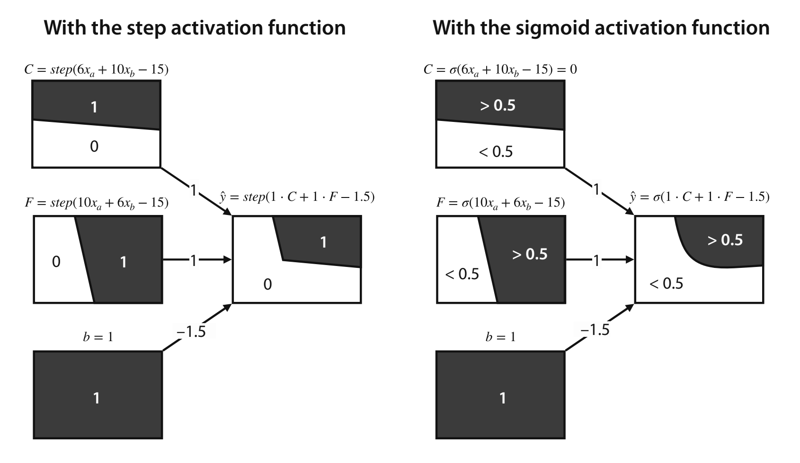
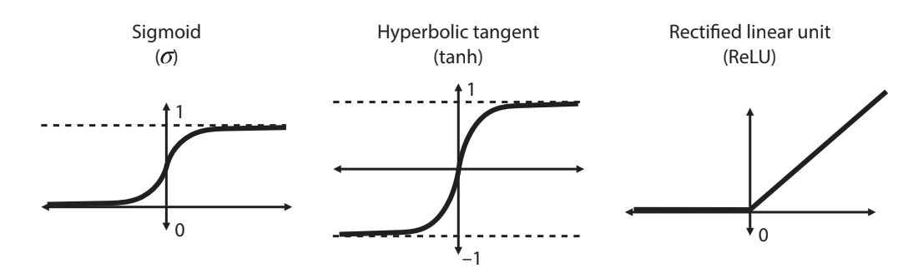

## Artificial Neural Networks

(based on [this textbook](https://www.google.com/books/edition/Grokking_Machine_Learning/fNhOEAAAQBAJ?hl=en&gbpv=0))

Neural Networks are one of the most popular machine learning models. They are meant to **mimic how the brain operates**, and can end up being very complex. The field of neural networks is referred to as *Deep Learning*.

Some important applications of Neural Networks are:

*   Image Recognition
*   NLP
*   Medicine
*   Self-driving cars

and more!

Terminology:
* **Perceptron** - An algorithm which uses a combination of features and weights to make a prediction
* **Discrete** - outputs 0 or 1
* **Continuous** - outputs any number in the interval (0,1)

----

## Minimum Viable Understanding (Read This First)
If you are learning asynchronously, prioritize these ideas first:
1. A perceptron is a weighted sum + bias + activation.
2. Stacking perceptrons allows nonlinear decision boundaries.
3. Training updates weights to reduce loss (backprop + gradient descent).
4. Overfitting is common and must be managed.

After these are clear, continue through the full examples.

---

## Example - Alien Planet
To understand Neural Networks better, we will explore an example where we are on a distant planet inhhabited by aliens. Their language is formed by 2 words, "*aack*" and "*beep*", and we want to build an ML model that will tell us whether an alien is happy or sad based one what they say. This is also an example of a *sentiment analysis* model.

Below is a dataset that contains sentences, the frequency of occurences of each word, and the determined mood (by external means):

Here's a plot of the data:

By the looks of the data, we wont be able to use a *linear classifier*, or split the happy and sad faces with just a straight line. Instead, we can use perceptrons to separate the points in the graph. We can build this network using 2 lines instead of one!

---

### 2 Lines

Above is one example of 2 lines we could draw that would help us classify the data by the type of face. The equations would be:
* 6xₐ+10xᵦ-15 ≥ 0
* 10xₐ+6xᵦ-15 ≥ 0

Where xₐ is the number of times *aack* appears and xᵦ is the number of times *beep* appears

The reason that we can't really model this happiness with 1 line is because happiness is not based on one thing, but many things - maybe having a fulfilling career, good family life, good friends, etc. Happiness is reliant on multiple factors, and therefore can't be modeled by a single line! In this model, we use 2 **perceptrons** to model the sentiment of the sentences.

### Combining Perceptrons

Neural Networks are built by taking the **outputs** of 2 perceptrons as **inputs** to a third perceptron. These perceptrons are discrete (only 0 or 1). Using our functions, we can define family and career happiness classifiers:

**Career happiness classifier**
* Weights:
  * *Aack*: 6
  * *Beep*: 10
* Bias: -15
* Score of a sentence: 6xₐ+10xᵦ-15
* Prediction: F=*step*(6xₐ+10xᵦ-15)

**Family happiness classifier**
* Weights:
  * *Aack*: 10
  * *Beep*: 6
* Bias: -15
* Score of a sentence: 10xₐ+6xᵦ-15
* Prediction: F=*step*(10xₐ+6xᵦ-15)

**Overall happiness classifier**
* Weights:
  * *Career*: 1
  * *Family*: 1
* Bias: -1.5
* Score of a sentence: 1 · C + 1 · F - 1.5
* Prediction: F=*step*(1 · C + 1 · F - 1.5)

Neural Networks are aptly named since their basic unit, the **perceptron**, vaguely resembles a neuron. A neuron has 3 parts: the soma, the dendrites, and the axon (see image above). The neuron receives signals coming from other neurons through the dendrites, processes them in the soma, and sends a signal through the axon to be received by other neurons. Perceptrons are very similar: it receives numbers as inputs, applies a mathematical operation to them (normally involving an activation function, which converts inputs to outputs), and outputs a new number.

### Graphical Representation of Perceptrons

Formally, a perceptron is defined with the following properties:
* Inputs: x1, x2, ..., xn
* Weights: w1, w2, ..., wn
* Bias: b
* An activation function: Either the step function (for discrete perceptrons) or the sigmoid function (for continuius perceptrons)
* A prediction: Defined by the formula *y=f(w1x1 + w2x2 + ... + wnxn + b)*, where *f* is the corresponding activation function

These properties can be seen in the visual representation above: The inputs are the nodes on the left, with the final node being 1. The weights are the edges connecting the inputs to the activation function, with the final edge being the bias. The operations for calculating the prediction happen in the activation function, and that node produces the output. At each perceptron, one can modify the weights and the bias. You can imagine that if we have many perceptrons, there would be many more parameters to be adjusted.

### Graphical Representation of Neural Networks

As mentioned, a neural network is made up of many perceptrons. It is made to loosely emulate the human brain, in which the output of several neurons becomes the input to another neuron. In the same way, in a neural network, the output of several perceptrons becomes the input of another perceptron. In practice, step functions are never used for neural networks because it would make it impossible to use gradient descent - so, the sigmoid function is widely used in neural networks.

---

### The Boundary of a Neural Network

Perceptrons have boundaries which define outputs based on their region. This is the same as the inequalities we defined earlier, just in a graphical way.

---

### General Architecture of a Fully Connected Network

In our example, we used a relatively small neural network. In practice neural networks are composed of many layers. The first layer is referred to as the input layer, the final layer is the output layer, and all intermediary layers are called hidden layers. The arrangement of nodes and layers is referred to as the *architechture* of the neural network. The total number of ayers is referred to as the *depth* of the neural network.

The size of a layer counts the non-bias nodes. In the above example, each node in one layer is connected to all nodes in the next layer. This is an example of a connected *architecture*.

This is a good visual example of a neural network, showing how the boundaries become more complex as you get deeper into the architecture.

---

### Training Neural Networks

Now that we've learned what a neural network is, let's explore how we can train one. In theory, training a neural network is not difficult. However, it can be very computationally expensive.

### Error

Here is the error function we can use to see how our neural network is performing. It will return a small value if the label and prediction are close to each other and a large value if they are not. In practice, neural networks can use a wide variety of loss functions, and can have extra terms to regularize the model's output.

### Backpropagation
In the past, we used [gradient descent](https://astarryknight.github.io/ai-ml/src/theory/grad_desc.html) to train our models. This is the same for neural networks, and we will be using a training algorithm known as *backpropagation*. The structure for backpropagation is:

* Initialize the neural network with random weights and biases
* Repeat:
  * Calculate the loss function and its gradient
  * Take a small step in the direction opposite to the gradient to decrease the loss by some amount
* Now, you should have weights for a neural network that should fit the data well

In practice, there are many libraries (which we will look at later) that have efficiently implemented backpropagation.

### Potential Problems
One problem that may arise when training a neural network is overfitting. This is very easy to occur, as neural networks are very complex. The first part of a neural network is deciding its architcture. When picking an architcture, the general rule of thumb is to pick an architecture that may be too complex for your application and apply some techniques to make it fit better.

**Regularization**:

To help reduce overfitting, we can add a regularization term to the error function. This can be the sum of the absolute values of the weights (without biases) multiplied by the regularization parameter (λ), or using the squares instead of absolute value.

**Dropout**:

This technique makes sure that everything is trained equally, not introducing more bias to the model. For example, you could create a workout regiment where you flip 2 coins before working out - if the left coin is heads, you tie your left arm behind you back, and the same for the right coin. Some days you would be working out both arms, some days one arm, and others none. However, the randomness of the coin as the sample grows (days) would ensure that you are training each arm equally.

This is done in the neural network with training the weights. The dropout algorithm removes some of the nodes randomly at each epoch, which forces the rest of the nodes to train in their place. Dropout has been proven to have a positive effect on reducing overfitting.

----

### Advanced Notes (Optional On First Pass)
The following are useful but optional for first completion of the intro path:
- Detailed regularization variants (L1 vs L2 tradeoffs)
- Activation function derivative behavior in deep stacks
- Hyperparameter interactions at scale (batching, architecture depth, dropout tuning)

### Activation Functions

We learned about certain activation functions, such as the step function for discrete perceptrons and the sigmoid activation function for continuous perceptrons. However, the sigmoid function has very flat derivatives on the ends, meaning that when we take its output and plug it into nodes in the next layer, the steps will be very small. Having a non-flat derivative helps with backpropagation. Instead, we can use other activation functions, such as the hyperbolic tangent (tanh) and Rectified linear unit (ReLU). Tanh has a similar shape to sigmoid, but is less flat at the edges. ReLU is another activation function, and it is very simple: if the input is negative, the output is 0. If the input is positive, the output is equal to the input. This means the derivative is 1 when the input is positive, giving us a good step over the sigmoid and tanh functions. In neural networks, we can combine these functions throughout our architechture. Most commonly, ReLU will be used for all nodes except for the last one, which will use sigmoid.

### Multiple Outputs
Some neural networks will have more than one output. To get a definite output, we can use the softmax function, which takes in the outputs and calculates the most probable of the outputs. For example, if we have an image classifiers that checks to see if an image is a bird, dog, or cat, the softmax function would generate probabilites based on the outputs for each type (bird, dog, and cat). The highest probability would then be considered the output or classification.

### Hyperparameters
Neural Networks use many hyperparameters that we can fine-tune to get them to work better. They determine many attributes about our training such as depth, length, and input method. Here are some of the most important hyperparameters:

* **Learning Rate**: the size of the step we use during training
* **Number of epochs**: the number of steps we use for our training
* **Batch vs. mini-batch vs. stochastic gradient descent**: how many points at a time enter the training process - do we enter points one by one, or in batches, or all at the same time?
* **Architecture**:
  * Number of layers in the neural network
  * Number of nodes per layer
  * Activation functions used in each node
* **Regularization Parameters**:
  * L1 or L2 (absolute value or squared)
  * The regularization term *λ*
* **Dropout probability**: *p*

### Mini!
Now that you understand how neural networks work, go try out the [Mini](https://astarryknight.github.io/ai-ml/src/minis/ann.html) for this lesson!
