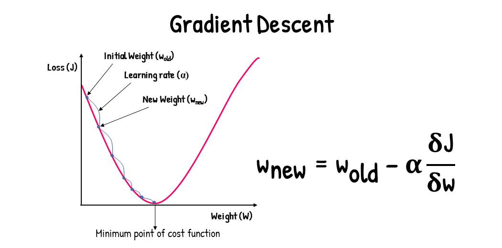
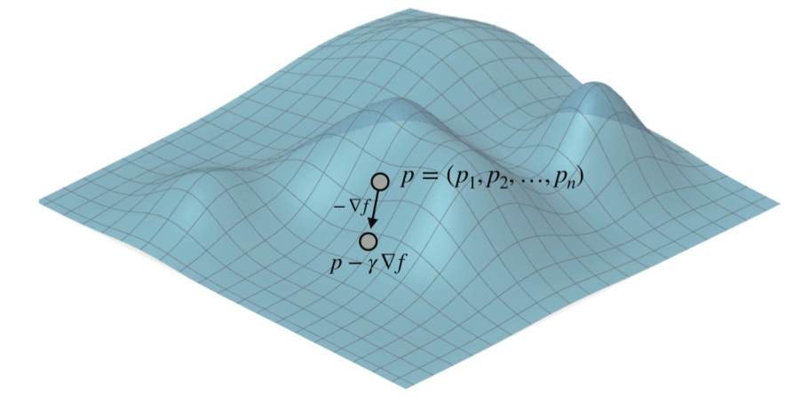
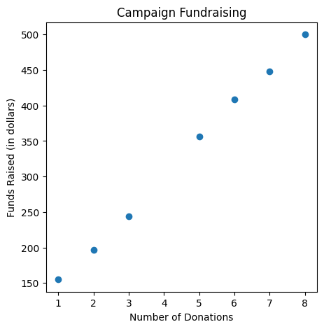
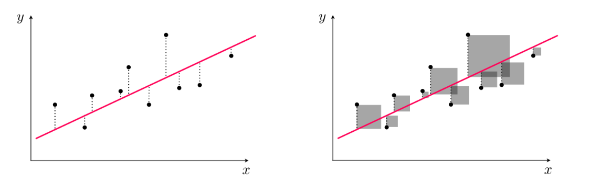
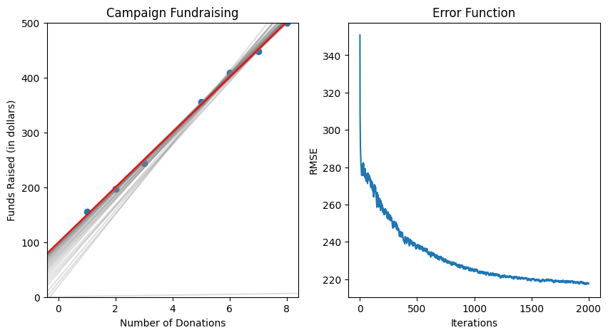

## Linear Regression
The most basic machine learning model is linear regression. This, like any other regression model, predicts for a continuous value. Since this is the most simple learning model, let's try to build it!

But first, what is linear regression?

"Linear regression is a statistical model which estimates the **linear relationship** between a **scalar response** and **one or more explanatory variables**"

Basically, linear regression is a way to predict a single target variable by using the linear relationship between that target variable and the rest of the features in the dataset. The goal of linear regression is to draw a line closest to all data points.

There is actually a really easy way to calculate the regression line, or line of best-fit, numerically, but let's try to use more of an machine-learning approach to linear regression. Let's look back at our 3-Step Framework. One thing that you may have noticed is that we did not account for some way to change our model in response to errors in our predictions. We make changes to our model to reduce error in a process called **optimization**. One way we can optimize our models is through *gradient descent*.

## Optimization: Gradient Descent


**Gradient** - a vector that points in the direction of the steepest increase of a function at a specific point

For a function of multiple variables, such as $$f(x, y, z)$$, the gradient is represented as the vector $$\nabla f$$, and its components are:

$$
\nabla f = \left[ \frac{\partial f}{\partial x}, \frac{\partial f}{\partial y}, \frac{\partial f}{\partial z} \right]$$



Gradient descent allowed us to easily correct errors in our models and worked quite well. The algorithm works best on convex functions with a single global minimum.

We will be using gradient descent to minimize the absolute and square error functions in our linear regression model. But don't worry, you won't need to know Calc 3.... yet.

Instead, we will implement a neat trick that uses gradient descent but in a simple way.

----

### Square Trick
To help us with building the model, let's consider a dataset of election campaign funding.

```python
import numpy as np
import matplotlib.pyplot as plt

features = np.array([1,2,3,5,6,7,8])
labels = np.array([155, 197, 244, 356,409,448, 500],dtype=np.float64) # Funds raised

fig, ax = plt.subplots(figsize=(5, 5))

ax.scatter(features, labels)
ax.set_title("Campaign Fundraising")
ax.set_ylabel("Funds Raised (in dollars)")
ax.set_xlabel("Number of Donations")
```


We can see that there is a clear linear relation between number of donations and funds raised, so let's build a linear regression model and optimize it.

To optimize our model we will use the *square trick*, which implements gradient descent. Before we start coding this trick, let's go over a pseudocode explanation.



Our line is refered to as a hyperplane, which is a n-1 dimensional plane that spans the entire space. In regression, we fit this hyperplane to be closest to all the points.

Our square trick optimizes the least squares cost function. For a given set of parameters  **w**, this cost function computes the total squared error between the associated hyperplane and the data (as illustrated pictorially in the picture above), giving a measure of how well the model fits the data. We reduce the square error by slightly adjusting the line by a certain amount. Alternatively, we could use the absolute value of the error.

----

**Pseudocode for Square Trick**

**Input**:
- A line with slope *m*, *y*-intercept *b*, and equation $$\hat{p}$$ = $$mr + b$$
- A point with coordinates ($$r$$,$$p$$)
- A small positive $$n$$ (our learning rate)

**Output**:
- A line with equation $$\hat{p}$$ = $$m'r + b'$$ that is closer to the point

**Procedure**:
- Add *nr*($$p-\hat{p}$$) to the slope $$m$$. Obtain $$m'= m+nr(p-\hat{p})$$ (this changes the slope to get closer to the point).
- Add *nr*($$p-\hat{p}$$) to the y-intercept $$b$$. Obtain $$b'= b+n(p-\hat{p})$$ (this translates the line to get closer to the point).

**Return**:
The line with equation $$\hat{p}$$ = $$m'r + b'$$

----

**Python Code for Square Trick**

```python
# Making our Square Trick
def square_trick(base_dono, funds_per_dono, num_donos, funds, learning_rate):
    predicted_funds = base_dono + funds_per_dono*num_donos
    funds_per_dono += learning_rate*num_donos*(funds-predicted_funds)
    base_dono += learning_rate*(funds-predicted_funds)
    return funds_per_dono, base_dono
```

We are essentially adjusting our line incrementally. In a specific rate called the **learning rate**.
- **Learning Rate** - A very small number we pick *before* training our model. This number makes sure we are only taking small steps with each adjustment.

----

### Linear Regression Algorithm
Once we have the square trick up, we basically have all we need to build our first model! The algorithm we are using takes an input of points and returns a line, and this line should incrementally get better as we go through iterations, or *epochs*. Let's take a look at the pseudocode.

----

**Pseudocode for the Linear Regression Algorithm**

**Inputs**:
- A dataset of campaign donations and total funds raised.

**Output**:
- Model weights: funds per donation and base funds

**Procedure**:
- Start with random values for the slope and y-intercept.
- Repeat for a specified number of times:
  - Pick a random data point.
  - Use the square trick to update the slope and the y-intercept

Before we actually write code and run our model, I want to visualize our error reducing as we descend, plotting the error function. To do this we will use the **Root Mean Square Error** function. Once we see that our error plateaus at a low level, we know when to end the iterations.

```python
# The root mean square error function
def rmse(labels, predictions):
    n = len(labels)
    differences = np.subtract(labels, predictions)
    return np.sqrt(1.0/n * (np.dot(differences, differences)))
```

----

**Python Code for the Linear Regression Algorithm**
```python
import matplotlib.pyplot as plt
import random

random.seed(64577) # Change the value in the parenthesis to get different results
def linear_regression(features, labels, learning_rate=0.01, epochs = 100):
    fig, ax = plt.subplots(figsize=(10, 5), nrows=1,ncols=2)
    funds_per_dono = random.random()
    base_funds = random.random()
    errors = []

    for epoch in range(epochs):
        if (epoch % 50) == 0: # We only plot every 50 epochs
            ax[0].axline(slope=funds_per_dono, xy1=(0,base_funds), color='gray',alpha=0.25)
        predictions = features[0]*funds_per_dono+base_funds
        errors.append(rmse(labels, predictions)) # storing error in array for plotting
        i = random.randint(0, len(features)-1)
        num_donos = features[i]
        funds = labels[i]
        # Running square trick to update slope and intercept
        funds_per_dono, base_funds = square_trick(base_funds,
                                                  funds_per_dono,
                                                  num_donos,
                                                  funds,
                                                  learning_rate=learning_rate)

    # Plotting the final graph
    ax[0].axline(slope=funds_per_dono, xy1=(0,base_funds), color='red')
    ax[0].scatter(features, labels)
    ax[0].set_ylim([0,500])
    ax[0].set_title("Campaign Fundraising")
    ax[0].set_ylabel("Funds Raised (in dollars)")
    ax[0].set_xlabel("Number of Donations")

    # Plotting the error function graph
    ax[1].plot(errors)
    ax[1].set_title("Error Function")
    ax[1].set_ylabel("RMSE")
    ax[1].set_xlabel("Iterations")
    plt.show()

    print('Funds Per Donation:', funds_per_dono)
    print('Base Funds:', base_funds)
    return funds_per_dono, base_funds
```

```python
linear_regression(features, labels, learning_rate = 0.01, epochs = 2000) # We can specify what our label and feature should be along with the learning rate and epochs
```


Currently, this only works with simple linear regression. If we want to do multiple linear regression, all we have to do is apply gradient descent to higher dimensions.

Now that you know the basics of machine learning and optimization, check out the [Spotify Recommendation Mini](https://astarryknight.github.io/ai-ml/src/minis/spotify.html)

----

## Troubleshooting Gradient Descent
- **Loss explodes or oscillates:** lower the learning rate.
- **Loss decreases very slowly:** raise learning rate slightly or increase epochs.
- **Inconsistent runs:** set random seeds for reproducibility.
- **Poor fit despite low training error:** inspect data quality and feature scaling.

## Quick Checkpoint Prompts
1. What role does the learning rate play in optimization?
2. Why can random initialization change the path of training?
3. What does a flattening RMSE curve suggest?

See [Checkpoints](../assessments/checkpoints.html) for answer guidance.
