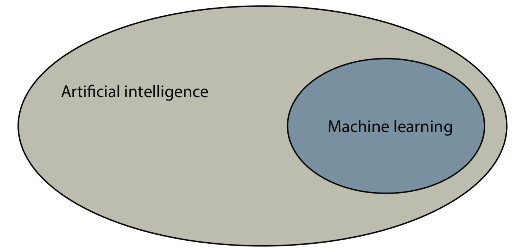
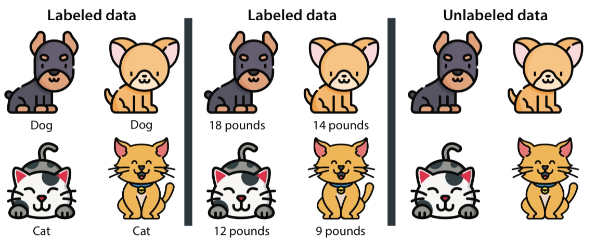
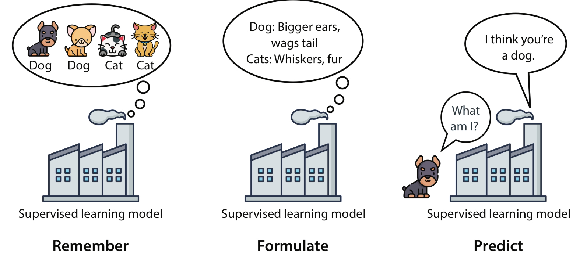
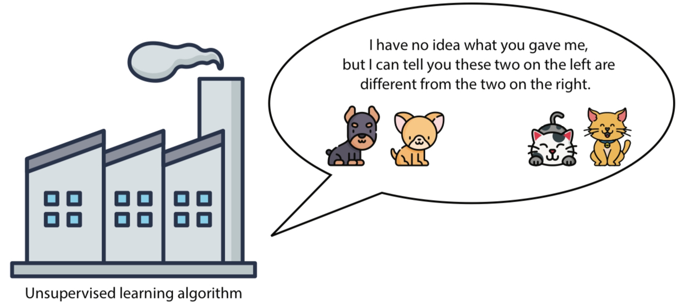
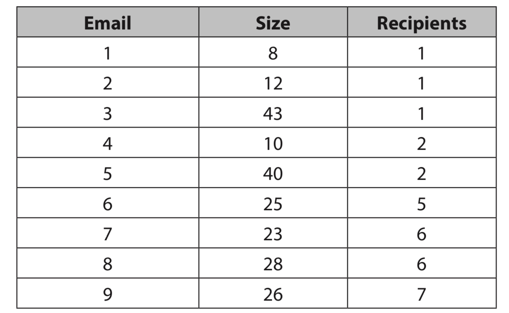
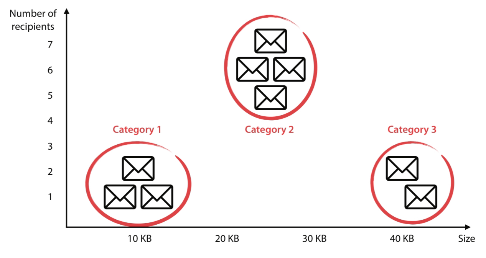
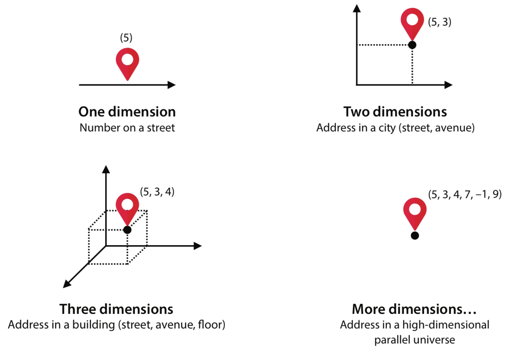

## Intro to Machine Learning - How do Machines Learn?

**Async note:** read this lesson together with [Evaluation Basics](./evaluation.html) and [Feature Engineering Basics](./feature_engineering.html).

Artificial Intelligence is a rather broad field encompassing many practices such as cognitive modelling, math, logic, and even philosophy. But in general, AI is concerned with examining and recreating methods in which something (specifically, a computer) can think.

For humans, we make decisions from two main methods:
- By using logic and reasoning (*Symbolic*)
- By using our experience (*Connectivist*)

Machine learning is concerned with the latter.

We may view **experience** as recalling or embodying past events in our memory, but in machine learning, experience is data. Thus, we come to a broad definition of machine learning:
- Machine learning is a field that encompasses all the tasks in which computers make decisions based on data, as opposed to being told which decisions to make.

There is also **deep learning** which is a part of machine learning.

Deep Learning (DL) - A field of machine learning that specifically uses certain objects called neural networks.

The most common machine learning that you will interact with on a daily basis is deep learning because it and neural networks work so well. For now, we will cover just machine learning.

Now that's all well and good, but how do we make an algorithm to create such learning models?

To still with more broad terms, machine learning can be though of as a 3-stage framework:
- **Remember**: Look at previous data
- **Formulate**: make a general rule (model) based on the data
- **Predict**: use the rule to make predictions about future data

In the end, you would want to adjust your rule to make your predictions even better.

Some useful terms:
- **model** - A set of rules that represent our data and can be used to make predictions
- **algorithm** - A procedure, or set of steps, used to solve a problem or perform a computation. In reference to models, an algorithm describes the method to construct a model
- **feature** - any property, characteristic, or variable in our data that the model can use to make predictions

In summary, machine learning really doesn't require complicated math or coding to understand the basics. Machine learning emulates common sense, but for computers. The machine will mimic certain ways humans think to make decisions accurately and quickly. To inform these decisions, machines use "experience" in the form of data. Finally, these decsions will ultimately be used to make some kind of prediction.

----

## Practical ML Workflow Loop
In practice, most projects follow this repeatable loop:
1. **Data** - gather and inspect data quality.
2. **Split** - separate train/validation/test data.
3. **Train** - fit a baseline model.
4. **Evaluate** - use task-appropriate metrics.
5. **Iterate** - improve preprocessing/features/model settings.

This loop is the foundation for all later topics in this curriculum.

## Types of Machine Learning
This is where we deviate a bit from conventional thinking. In humans, when you learn or think, you don't really assume that there are different types of learning, but for machines, things aren't that simple.

Broadly speaking, there are three families of machine learning models:
- **Supervised learning**
- **Unsupervised learning**
- **Reinforcement learning**

We will be discussing only the first two: supervised and unsupervised learning (reinforcement learning will be covered later!)

Huge surprise incoming: we will be talking about types of data again (hooray!)
Recall that features are variables in our data that we consider to make predictions. These features will be key to understanding these two methods of machine learning.

In supervised learning, features that we will predict are called the target variable, or labels. These labels are considered **dependent** on the other features.

----

**Labeled and Unlabeled Data**

Labeled data is data that comes with some kind of label, and unlabeled data is data that comes with no labels. The same dataset may be labeled or unlabeled depending on what you are trying to achieve with the data. To better explain this, let's come up with examples.

**Labeled Data** - We have a dataset of emails containing information like the date the email was recieved, how large is the message, etc. One of the features of the dataset is a boolean value of whether or not the email is spam or not. In our case, we'd like to predict whether or not a given email is spam or ham, so our label, or target variable, is the boolean value.

**Unlabeled Data** - We have a data set of pictures of bees and trees. The features are the pictures themselves with no other label. Its up to the model to group these pictures that make sense to us.

----

### Supervised Learning
Okay, so everything so far should be somewhat of a review. We've dealt with features and data before, but what's different now?

Well, now it's time to introduce some fundamental concepts of machine learning. First, we'll cover **supervised learning**

Supervised learning is a branch of machine learning that works with labeled data. We can see this kind of learning in many prediction tasks like image/voice recognition, sentiment analysis, and much more daily applications. In simple terms, supervised learning **makes predictions for the target variable**

As discussed earlier, the 3-stage framework can be effectively applied to supervised learning. Let's look at more cats and dogs.

In this example, the model recalls past information (labeled data) of dogs and cats. It formulates from this experience that dogs have *bigger ears* and *wags their tails* while cats have *prominent whiskers* and *triangle ears*. Thus, when a dog is presented to the model, the model predicts that the dog truly is a dog **without being explicitly told that it is a dog**.

What I just described can also be considered a *classification model*, since it classifies an animal as a dog or a cat. There are two main model types within supervised learning: **classification** and **regression**.

----

### Classification and Regression Models
**Classification Models** - the types of models that predict categorical data. The output of a classification model is a *category*, or *state*.

**Regression Models** - the types of models that predict numerical data. The output of a regression model is a *continuous number*.

----

**Classification Models**

Classification models are those in which the label we want to predict is a state belonging to a finite set of states. Most classification models usually only assigns true or false value for a single target, but it is possible to have *multiclass* classification where the model predicts multiple states.

Some common applications include:
- Fraud Detection
- Sentiment Analysis
- Image Recognition
- Recommendation Systems

**Regression Models**

Regression Models predict the value of a numeric label. Thus, the output of the model is not a state but some numerical value. Let's say that we have a regression model that takes in data about a particular car, where the features include the make, model, year, weight, mileage, etc. of a particular car and predicts for its sale price. Since price is a continuous numerical value, a regression model is indeed appropriate in this case.

Some common applications include:
- Stock/Investment Prediction
- Sales and Pricing

----

### Unsupervised Learning
Unsupervised learning leverages *unlabeled data* to extract as much information as possible from the dataset to predict. Since we have no labels to predict, we are limited in some ways, but using unsupervised techniques can be a lot more practical since it does not require large sets of labeled data. This is especially useful when what you are trying to predict for does not occur often, or there is little documented data on it. For example, if you want to predict for potential tax fraud, most cases of tax fraud are not easily disclosed and obtained for the public. Thus, using an unsupervised model circumvents the need for labeled data in favor of recognizing significant patterns or information within the data that may indicate tax fraud.

Let's take a look at cats and dogs again. If we remove the labels indicating whether an animal is a cat or a dog, we can train an unsupervised model to find differences between cats and dogs without being explicitly told and using these differences, or similarities, to group the two separately from each other. If done properly, the algorithm will successfully separate the dog images from the cat images.

----

### Clustering and Dimensionality Reduction
Like supervised learning, unsupervised learning is a vast field with several types within it. The main branches of unsupervised learning are clustering, dimensionality reduction, and generative learning.

**Clustering Algorithms** - groups data into clusters based on similarity to other data points

**Dimensionality Reduction Algorithms** - reduces the dimensions of a dataset, simplying the data while conserving significant information but with fewer features.

**Generative Algorithms** - algorithms that generate new data points that resemble existing data points (ChatGPT, Stable Diffusion, Llama, etc.)

We will only be covering clustering and dimensionality reduction. Generative learning deserves its own workshop, so we may cover it at some point later.

----
**Clustering Algorithms**

Clustering is a branch of unsupervised learning that consists of the tasks that group elementrs in our dataset into *clusters* where all the surrounding data points are similar. Because this is unsupervised, the clusters that are created do not have any meaning other than that these data points are similar. After clustering, a human (or some other algorithm) could then label these clusters to give them meaning.

If we consider a data set of spam and ham emails **without** the labels of spam, a clustering algorithm would group these emails into clusters. Now, these clusters *could* represent spam and ham emails, but human analysis is still needed.

To humans, recognizing these clusters is simple, but for computers, this task is complicated and needs a specific algorithm to recognize/form these clusters. On the other hand, imagine if instead of two dimensions of data, we have hundreds of dimensions with millions of data points; it would be impossible for us visualize or to recognize any clusters. So, we must rely on computers.

Some clustering algroithms include:
- K-Means Clustering
- Hierarchical Clustering
- Density-based Spatial Clustering (DBSCAN)

----
**Dimensionality Reduction**

Generally, dimensionality reduction is useful in simplifying the features/dimensionality of our data while conserving important aspects to it.

Let's look at an example of a data set of people in a city. Suppose that each person has an address consisting of 5 features: street, building, floor, room, and distance from door. If our objective is to simply process data from the address of somebody in the city at a given moment, using all these features is not very useful. Realistically, we probably only need the street and building to suffice for an address since relatively few people will be in the exact same street and building at a given time. Thus, we *drop the 3 other features* to reduce down to only 2 dimensions from 5.

And that does it for the basics! There are other techniques like reinforcement learning, online learning, and batch learning, so you can research more if you'd like.

----

## Common Pitfalls (Beginner Checklist)
- Training and testing on the same data.
- Choosing metrics that do not match the real task objective.
- Ignoring class imbalance in classification.
- Confusing correlation with causation.
- Changing many variables at once, making iteration hard to interpret.

For answer checks and progression, use [Checkpoints](../assessments/checkpoints.html).
