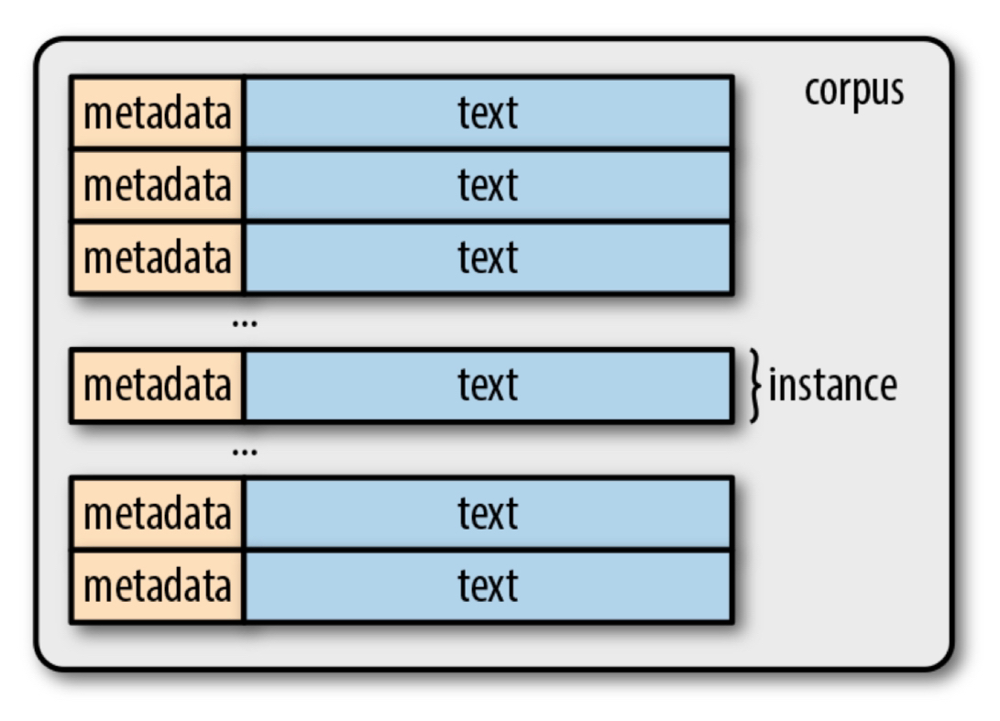
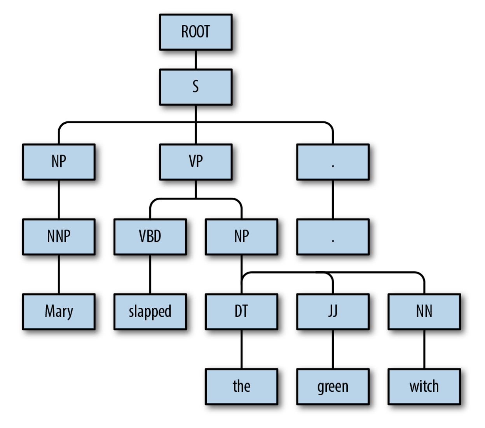
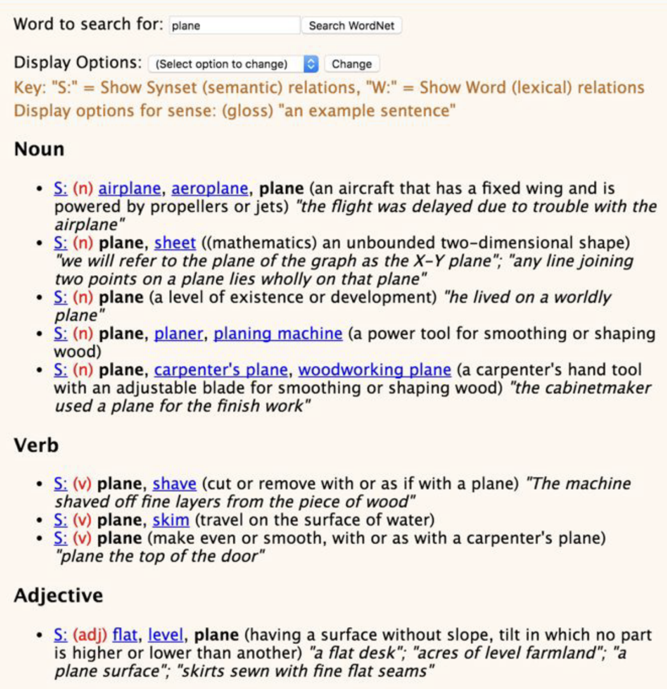

## Natural Language Processing

Natural Language Processing (NLP) is currently the "hot" market of AI as it is incorporated in applications like:

*   Text Generators
*   Virtual Assistants
*   Speech Recognition
*   Chat Bots

The fundamental definition of Natural Language Processing:
> A subfield of artificial intelligence and computational linguistics that focuses on human-computer interaction.

In other words,
> Making a Computer "think" and "act" like a Human

NLP involves a computer understanding text for the sake of solving real-world tasks.

----

## Minimum Viable Understanding
Before moving on, make sure you understand:
1. Tokenization and vocabulary basics.
2. Why normalization (lemmatization/stopword handling) matters.
3. How text becomes features for ML models.

----
## Basics of NLP

### Corpora and Tokens
Some terms to know

**Corpus** - a text dataset that usually contains raw text and any metadata associated with the text; our dataset for NLP tasks

**Instance** - text accompanied by any other metadata (basically the same definition we have been using)

**Token** - contiguous units in a language that typically corresponds to words and numeric sequences separated by white-space characters or punctuation.

**Tokenization** - splitting a string of text (a sentence) into tokens
- "the quick brown fox jumps over the lazy dog" has 9 tokens.
- Note that tokenization does not work well for many languages, but we can go around this by representing the text as a stream of bytes, but we will keep things simple for now.



**Types** - unique tokens in a corpus

**Vocabulary**(lexicon) - the set of all types in a corpus

**Content Words** - words that typically have significant meaning over stop words

**Stop Words** - "filler" words between content words, like articles, prepositions or really any other word that serves a mostly grammatical purpose

----

### N-Grams
**N-grams** - fixed length (n) consecutive token sequences occuring in text.

Bigrams have two tokens and unigrams have one.

Sometimes, you want to have *character n-grams* which split the text into subwords, which could carry useful information
**Example** - "de-" typically carries a negative, or undoing, connotation

Task: List the bigrams of the following sentence:

"This is our fourth week"
(This is, is our, our fourth, fourth week)

----

### Lemmas and Stems 
**Lemma** - root form of words

Example: drive has drove, driven, driving, drives

We can reduce all these words to just their root word. This is called **lemmatization**. This can help us reduce the amount of unique tokens we need to process since all these words essentially carry a similar meaning.

```python
import spacy as sc

nlp = sc.load('en_core_web_sm')
doc = nlp(u"Mike found his dog sitting on a chair")
for token in doc:
  print('{} -> {}'.format(token, token.lemma_))
```

```markdown
Mike -> Mike
found -> find
his -> his
dog -> dog
sitting -> sit
on -> on
a -> a
chair -> chair
```

----

### POS Tagging
We can label individual words with what **part of speech** (POS) the word is. For example, we would say "Mike" is a Proper Noun or "red" is an adjective, and so on.

```python
import spacy as sc
nlp = sc.load('en_core_web_sm')
doc = nlp(u"According to all known laws of aviation, there is no way a bee should be able to fly")
for token in doc:
  print('{} -> {}'.format(token, token.pos_))
```

```markdown
According -> VERB
to -> ADP
all -> DET
known -> VERB
laws -> NOUN
of -> ADP
aviation -> NOUN
, -> PUNCT
there -> PRON
is -> VERB
no -> DET
way -> NOUN
a -> DET
bee -> NOUN
should -> AUX
be -> AUX
able -> ADJ
to -> PART
fly -> VERB
```

----

### Chunking and Named Entity Recognition

**Chunking** - labelling a span of text, or multitoken boundary

We can use **chunking** to identify different phrases, such as verb phrases and noun phrases. This makes the text easier to process.

```python
import spacy as sc

nlp = sc.load('en_core_web_sm')
doc = nlp(u"Mary slapped the green witch")
for chunk in doc.noun_chunks:
  print('{} -> {}'.format(chunk, chunk.label_))
```

```markdown
Mary -> NP
the green witch -> NP
```

**Named entity** - a mention of a real-world concept like a person, location, organization, etc.

Example: John (person) was born in the United States (GPE - Geopolitical Entity).

----

### Structure of Sentencees

**Parsing** - the task of identifying the relationship between phrases

Parse trees show how different greammatical units in a sentence are related.



----

### Word Senses and Semantics

Every word has a meaning, and often they have more than one. The different meanings of a word are referred to as its **senses**.

Example: Senses for the word "plane":



Word senses can be deduced from the context of the word, through semi-supervised learning and NLP.

----

### Optional Depth (Second Pass)
If you want extra depth after finishing the core path:
- More robust tokenization for multilingual text
- Contextual embeddings and transformer tokenization
- Sequence models and modern LLM pipelines

Now that we're done with the baiscs of NLP, let's work on an example: [NLP with Disaster Tweets](https://astarryknight.github.io/ai-ml/src/minis/nlp.html).
