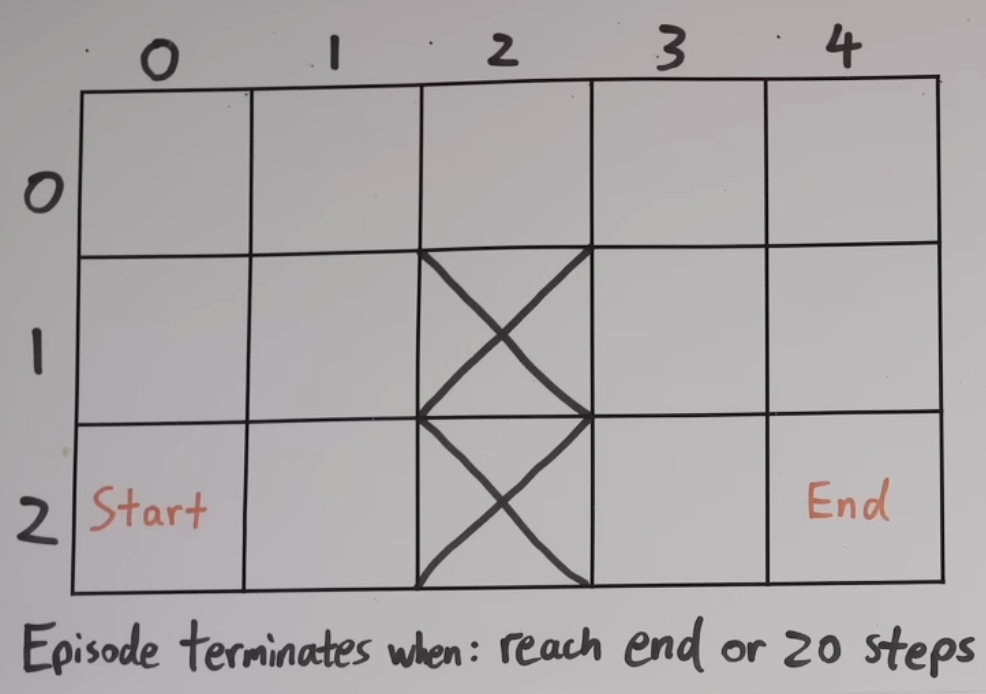
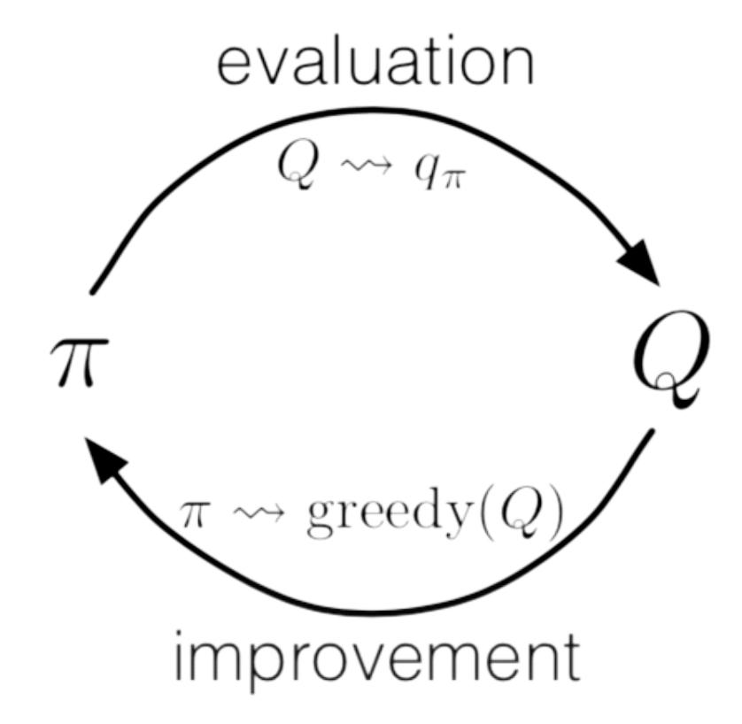

## Reinforcement Learning
(based on [this video](https://www.youtube.com/watch?v=VnpRp7ZglfA))

Reinforcement Learning (RL) is a field of machine learning that aims to create solutions to problems that can’t be hard-coded. It uses trial and error, along with positive and negative rewards, to reinforce and punish certain behaviors. It is appealing as it is very similar to how humans and animals learn about the world around them.

Reinforcement learning has already been applied to many different applications, such as:

* Beating Atari games
* Autonomous vehicles
* Robotics

and so much more!

----

## Minimum Viable Understanding
For first-pass async completion, focus on:
1. Agent-environment interaction loop.
2. Reward-driven learning over trajectories.
3. Exploration vs exploitation balance.
4. Value function intuition.

----

### Agents & Environments

In RL, there are two main components: **agent** and **environment**.

The agent is something you can directly control, while the environment is something that can’t be directly controlled, but interacted with through the agent. We refer to agent-environment interactions as **actions**, and environment-agent interactions as **states**, or some properties we are observing.

The way we define all of these parameters is arbitrary, and this can actually be a good thing. It gives us freedom to choose which parameters help us solve the problem in the most efficient manner.

In addition to actions, there are also **rewards** that are associated with the action (both positive and negative), generally regarded to flow from the environment to the agent.

----

### Markov Decision Processes

**Markov Decision Process (MDP)**: Discrete, repeating sequence of state, action, and reward:

$$s_0, a_0, r_0, s_1, a_1, r_1, s_2, a_2, r_2, …$$ 

**Markov Property**: Each state is only dependent on the immediately preceding state

The goal of an MDP is to use the information from a state, e.g. $$s_t$$ to find an action $$a_t$$ that maximizes subsequent rewards $$r_t, r_{t+1}, …$$.

**Policy Function ($$\pi$$)**: a function that takes a state as an input and returns an action, $$f(s)=a$$. In practice, this function returns a probability that a certain action is good based on the state, since there may be more than one positive action. In traditional notation:

$$\pi(a \vert s) = p$$

where $$p$$ is a probability.

**Return ($$G_t$$)**: sum of all rewards starting from a timestep $$t$$, and progressively multiplied by a discount factor, $$\gamma$$:

$$G_t=r_t+\gamma r_{t+1} + \gamma^2 r_{t+2} + \gamma^3 r_{t+3} …$$

where the discount factor is defined as $$0 \leq \gamma \leq 1$$. This can be a smaller number, if you want to highlight that the future is inherently harder to predict, or 1 to treat everything equally. 

So, our goal is simple: Find the policy that maximizes the return.

----

## Grid Example

Let’s take a simple grid example to explain more about RL.

Here is our maze:

We have an agent inside the maze (environment) that will try to move from the start to the end within 20 moves. We can define our RL parameters:

State: 2 numbers - (x,y) coordinates

Action: 1 number - 1/2/3/4 (up/down/left/right)

Reward: 0 if in target cell, -1 otherwise

----

### World Model
**World Model**: an agent’s understanding of its environment, e.g. how a state and action will affect the following state and reward. Mathematically,

$$p(s’,r \vert s,a)$$

This world model is crucial to the learning capabilities of an agent.

To start, however, we’ll look into model-free methods, which assume the agent does not have access to a world model. This also means that it doesn’t understand what the state and action represent, and how the rewards work.

----

### Policy and Value Functions

If we ran this simulation like this, we’d likely see most end up with a score of -20, not actually completing the maze. While this may seem pointless, we are recording all of the actions and their resulting states. This is known as **sampling**, and each sequence of state, action, and reward is called a **trajectory**. The few trajectories that do reach the end are the ones we want to focus on.

To teach the agent better maze solving techniques, we need to modify the policy function to represent our environment. One way of doing this is using a **policy gradient** method, or directly editing the probabilities based on the returns for different actions. However, to do this, we must already know what is considered good/bad.

To define this, we can use **value functions** that define a baseline, keeping track of the average return ($$G_t$$) expected when following a certain policy ($$\pi$$) in a certain state ($$s$$) or state + action ($$s,a$$).

The **state-value function**, $$V_{\pi}(s)$$, represents the expected return for a given state following a certain policy. The **action-value** function, $$Q_{\pi}(s,a)$$, represents the expected return if you are in a given state, take a certain action, then follow a certain policy.

If you’d like to ignore the policy function and find the best-case scenario, we can use $$V_*(s)$$ and $$Q_*(s,a)$$, or the optimal value functions.

Once we have our value functions, we can now improve our policy! There are a few methods:

1. Policy gradient method (mentioned above)
- Issues with variance (different averages)
- More dependent on **policy function**
2. Policy gradient method, with value function
- Accounts for variance, which is good
- Balance using **policy & value function**
3. Just use action-value (Q) function
- Cyclic dependency: the action-value function is dependent on the policy function, but our policy function is now dependent on the action-value function!
- More dependent on **value function**

### Evaluation
Now, let's look into how we can develop good value functions. We’ll start with the action-value method (#3), since it doesn’t have a policy function dependency. 

The simplest way to develop our action-value function is to take our collected trajectories and average out the returns for each state and action pair. We can do this by starting each value at 0 and shifting them slowly towards the returns we have in our trajectories. This ends up with a distribution where good state-action pairs will have good values, and bad state-action pairs will end up with worse values.

If we run this simulation for a large number of attempts, we can observe that the policy function will update based on our action-value function, and the action-value function will also update based on the policy. This cyclic dependence is called generalized policy iteration, where $$Q_{\pi} \to Q_*$$ and subsequently $$\pi \to \pi*$$.

### Exploration vs Exploitation
Epsilon ($$\epsilon$$) is a variable that maintains a balance between exploration and exploitation. One downside of the action-value approach is that to generate the policy function, it generates a random distribution for all actions. However, when it wants to start performing well to increase returns, it can use exploitation, which just sets the action with the highest return to 100%, and the rest to 0%, effectively nullifying the distribution. When improving in RL, we need a balance between exploration and exploitation - to both try out different things to improve, and take advantage of improvements to perform well.

In short, epsilon represents the proportion of time that actions are picked randomly, decreasing over time as the policy improves and less exploration is needed.

----

### Optional Depth (Second Pass)
You can revisit these topics after completing core minis:
- Policy gradient variance issues and baselines
- Generalized policy iteration convergence details
- Function approximation and deep RL stability concerns

Now that you’ve mastered the basics of RL, let’s try out [Playing Snake with RL](https://astarryknight.github.io/ai-ml/src/minis/rl.html)
